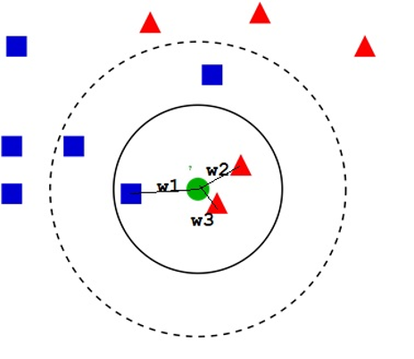
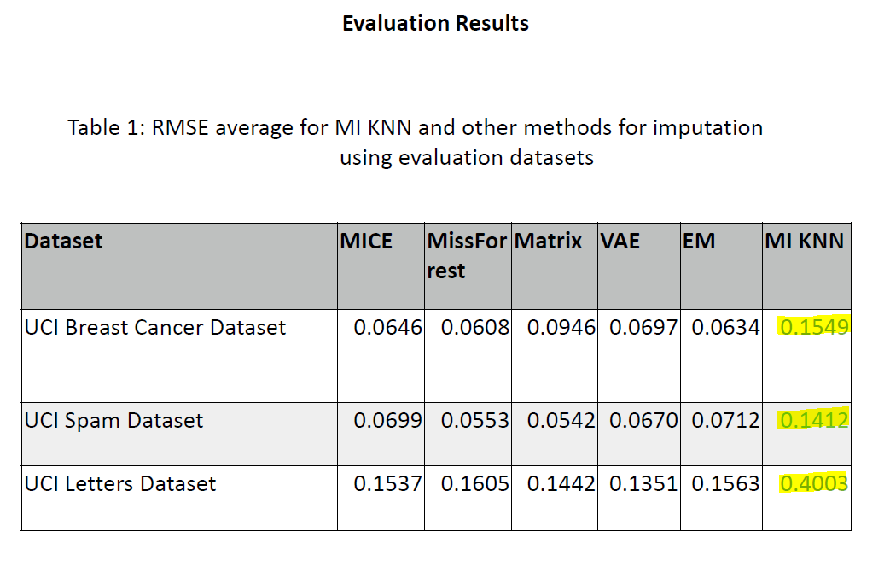

# MIKNN Impute
- Datasets can be found in "imputation/data"
- MIKNNImpute is compatible with all three datasets
- *Note: This code assumes that the headers of the data is removed
- To run the code on your own dataset, place the csv file in the 'data' directory in the parent folder ("imputation/data") and provide the file name as a function parameter to the 'main' function in the python file 'main.py'

### Title of the paper
K nearest neighbours with mutual information for simultaneous classification and missing data imputation

### Full citation
[Pedro J.García-Laencina, José-Luis Sancho-Gómeza, Aníbal R. Figueiras-Vidal, Michel Verleysenc. “K nearest neighbours with mutual information for simultaneous classification and missing data imputation”. Neurocomputing, Volume 72, Issues 7–9, Pages 1483-1493, 16th European Symposium on Artificial Neural Networks, Bruges, Belgium, March 2016.](https://www.sciencedirect.com/science/article/pii/S0925231209000149)

### Original Code
[iskandr/fancyimpute](https://github.com/iskandr/fancyimpute)

## Description
- Task: Data Imputation using MI K-Nearest Neighbors Algorithm <br />
Approach:
* Input is filled numerical dataset
* Introduce missingness randomly 
* The algorithm:
	* The KNN-based method selects rows with profiles similar to the row of interest (row with missing value) to impute missing values. 
	* If we consider row A that has one missing value in column 1, this method would find K other rows, which have a value present in column 1, with expression most similar to A in columns 2–N (where N is the total number of columns). 
	* The weighted average of values (with closer neighbors having greater weights) in column 1 from the K closest rows is then used as an estimate for the missing value in row A.

<p align="center"></p>

## Input and Output
Input: Table[relation] as .csv file <br />
Output: Imputed Table[relation] as .csv file <br />

## Evalution
- Benchmark datasets (complete, numerical) 
1. Letter Recognition: http://archive.ics.uci.edu/ml/datasets/Letter+Recognition
> 20000 x 16 [rows x columns]
> Features are various parameters of 26 alphabet images
2. Breast Cancer (Diagnostic): http://archive.ics.uci.edu/ml/datasets/breast+cancer
> 569 x 32 [rows x columns] 
> Contains features from digitized images
3. Spam-base: http://archive.ics.uci.edu/ml/datasets/spambase
> 4601 x 52 [rows x columns] 
> Contains features about e-mails and class label: spam/not spam

- Evaluation metrics and results
- Evaluation Metric: Root Mean Square Error (RMSE) 
- Results:
<p align="center"></p>

## Demo
- Link to the Jupyter Notebook 
[Jupyter Notebook](https://github.com/hemkeshv/ditk/blob/develop/data_cleaning/imputation/miknnimpute/miknnimpute.ipynb)
- Link to the video on Youtube
[YouTube Video](https://youtu.be/OTAKx1eVuVc)

## Process for running the code using the main file
- The code assumes that Python 3, pip and git are installed
- Install Python 3.6, pip
```bash
sudo apt-get update
sudo apt-get install python3.6
sudo apt install python3-pip
```
- Clone the repository
```bash
git clone https://github.com/data-integration-toolkit/ditk.git -b develop --single-branch
```
- Navigate to code directory within the repository
```bash
cd ditk/data_cleaning/imputation/miknnimpute/
```
- Install required packages
```bash
pip3 install -r requirements.txt
```
- Run the code
```bash
python3 main.py
```
- Navigate to test directory within the repository
```bash
cd test/
```
- Run the test cases
```bash
python3 sample_test.py
```