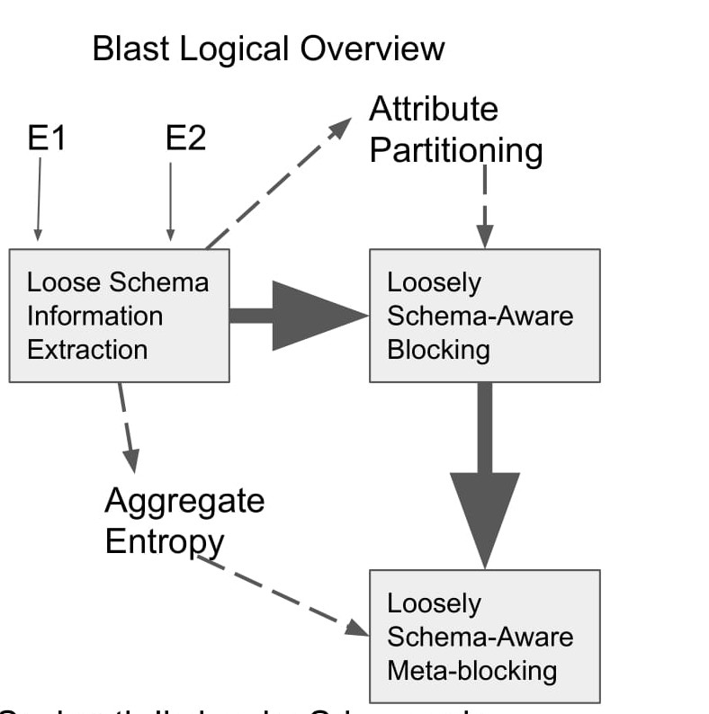
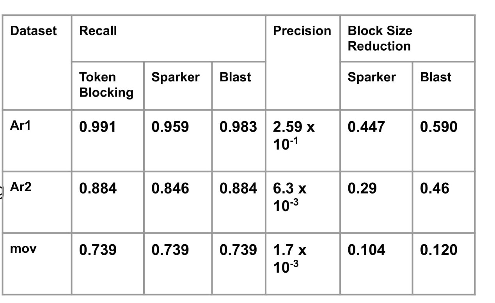

# Blast
- BLAST: a Loosely Schema-aware Meta-blocking Approach for Entity Resolution.
- G. Simonini, S. Bergamaschi, & H. V. Jagadish (2016). BLAST: a Loosely Schema-aware Meta-blocking Approach for Entity Resolution. Journal Proceedings of the VLDB Endowment Volume 9 Issue 12, August 2016, Pages 1173-1184
- http://www.vldb.org/pvldb/vol9/p1173-simonini.pdf

## Original Code
https://github.com/Gaglia88/sparker/tree/master/python

## Description

 

- Demonstrates how “loose” schema information (i.e., statistics collected directly from the data) can be exploited to enhance the quality of the blocks in a holistic loosely schema-aware (meta-)blocking approach that can be used to speed up your favorite Entity Resolution algorithm.
- Partitioning of attribute namespace: attributes are partitioned according to the similarity of their values using: 
-- Aggregate entropy of attribute clusters and LSH
-- Uses Shannon entropy
- Schema-agnostic blocking(Token Blocking) technique is enhanced by exploiting the attributes partitioning.
- A graph-based meta-blocking is applied where the weight of an edge is proportional to the information content of its associated attributes.

## Input and Output
- Prediction:
- Input: List of pandas.Dataframe obtained from read_dataset()
- Output: List of tuple containing pairs of ids of entities in the same block.

- Train: No training required.
- Input: List of pandas.Dataframe
- Output: None

## Evaluation
- Benchmark datasets:

- DBLP-Google Scholar(Ar2): Matches article profiles from dblp.org and scholar.google.com

- ImdbMov(mov): matches movie profiles from imdb.com and dbpedia.org

- DBLP-ACM(Ar1): Matches article profiles from dblp.org and dl.acm.org

- Evaluation Metrics:
	Precision, Recall, Block size reduction (relative to Token Blocking).

- Results:

 

## Demo
- Link to video: https://youtu.be/6WQwx-KBWIU
- Link to Jupyter notebook: 