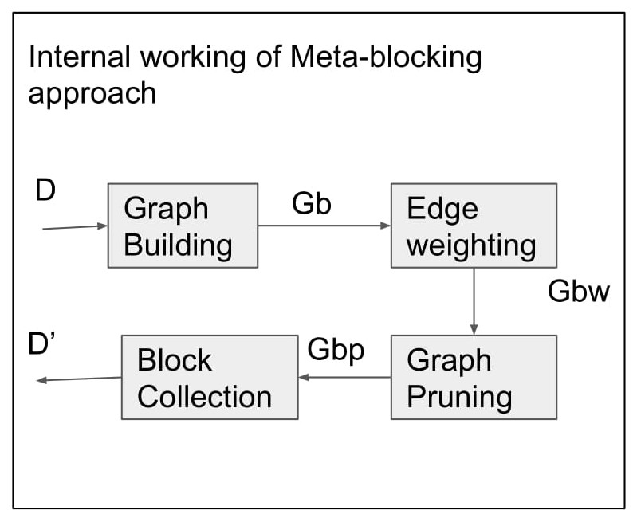
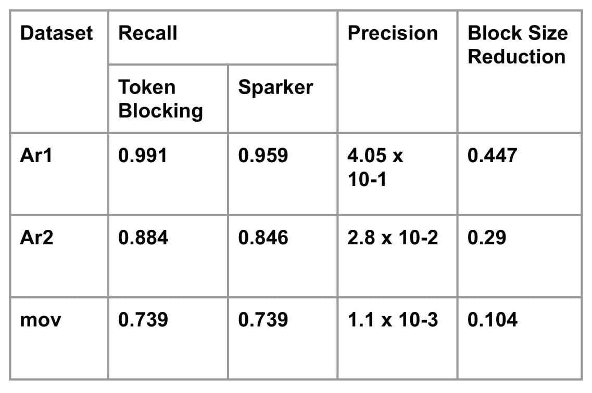

# SparkER
- Meta-blocking: Taking entity resolution to the next level.
- Papadakis, G., Koutrika, G., Palpanas, T., & Nejdl, W., Meta-blocking: Taking entity resolution to the next level. IEEE Transactions on Knowledge and Data Engineering 26(8), 2014.

## Original Code
https://github.com/Gaglia88/sparker/tree/master/python

## Description

 

- Aims at improving the efficiency of redundancy-positive blocking methods by discarding the unnecessary comparisons of their blocks. Takes the blocking produced by Token Blocking as input to create a Blocking Graph.
- Edge weighing is used to further prune the graph to remove superfulous edges from the graph
- Finally the pruned graph is collected to form Blocks.

## Input and Output
- Prediction:
- Input: List of pandas.Dataframe obtained from read_dataset()
- Output: List of tuple containing pairs of ids of entities in the same block.

- Train: No training required.
- Input: List of pandas.Dataframe
- Output: None

## Evaluation
- Benchmark datasets:

- DBLP-Google Scholar(Ar2): Matches article profiles from dblp.org and scholar.google.com

- ImdbMov(mov): matches movie profiles from imdb.com and dbpedia.org

- DBLP-ACM(Ar1): Matches article profiles from dblp.org and dl.acm.org

- Evaluation Metrics:
	Precision, Recall, Block size reduction (relative to Token Blocking).

- Results:

 

## Demo
- Link to video: https://youtu.be/wJz1Fyx9t_U
- Link to Jupyter notebook: https://github.com/SushanthIkshwaku/ditk/blob/develop-py2/entity_linkage/blocking/sparkER/sparkER.ipynb