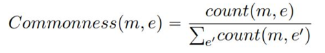
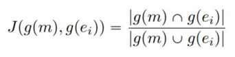

# Unsupervised Entity Linking with Abstract Meaning Representation

## Citation:

* Ulf Hermjakob, Kevin Knight, Heng Ji, Taylor Cassidy, Xiaoman Pan Unsupervised Entity Linking with Abstract Meaning Representation. Human Language Technologies: The 2015 Annual Conference of the North American Chapter of the ACL, Denver, Colorado, May 31 – June 5, 2015 [pdf](https://aclweb.org/anthology/N15-1119)
* https://github.com/panx27/amr-reader

## Prerequisite
- Python 3
- PyGraphviz for AMR visualization functionality

## Input/Output format for prediction

**Input:**
- text file containing sentences:
  - Example:
  - ```He needs to conduct a beer summit between Palin and NBC.```

**Output:**
- AMR named entity
- AMR paths
- AMR graph
- AMR nodes

## Approach
AMR captures contextual properties discriminative enough to make linking decisions, without the need for EL training data.
AMR captures whole sentence meanings in a rooted, directed, labeled, and acyclic graph structure.
This is achieved by the following steps:
- Salience for each mention m is to generate an initial ranked list of candidate entities E =(e1, ..., eN) where N is the cutoff for number of candidates. It is given by following:


- Context collaborator based re-ranking is driven by the similarity between mention and entity knowledge networks. We re-rank E according to Jaccard Similarity, which computes the similarity between
g(m) and g(ei):


- Context Coherence Based Re-ranking: Here, the highest similarity combination is selected, yielding a top candidate for each mention

- AMR Entity Node represents an entity mention, and contains its canonical name as inferred from sentential context.

## Benchmark datasets

- AMR R3 corpus (LDC2013E117)
- CoNLL 2003
- AQUAINT
- ACE 2004

## Evaluation metrics and results

|                |   F1   |
| :------------: | :----: |
| AMR R3 corpus  | 0.814  |

## Jupyter Notebook

[demo.ipynb](./demo.ipynb)

## To run demo.ipynb
* Input
- indir directory to AMR input files
- outdir output directory
- arguments:
    - g to generate AMR graphs
    - n to generate AMR nodes
    - p to generate AMR paths
    - e to generate named entities

## To run main.py
```
python main.py [-h] [-g GRAPH] [-n] [-p] [-e] indir outdir
e.g., python main.py test/input/ output/ -n
indir                 directory to AMR input files
outdir                output directory

optional arguments:
  -g to generate AMR graphs
  -n to generate AMR nodes
  -p to generate AMR paths
  -e to generate named entities
```

## YouTube Video
https://youtu.be/1V87a-SUgZI
