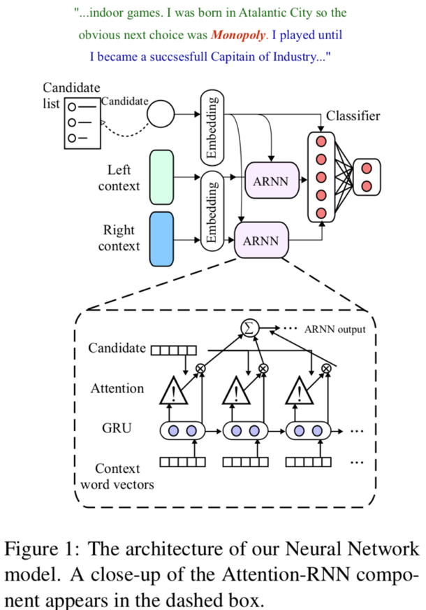

# ned_for_noisy_text
- Named Entity Disambiguation for Noisy Text
- Yotam Eshel, Noam Cohen Kira Radinsky, Shaul Markovitch, Ikuya Yamada and Omer Levy. Accepted to CoNLL, 2017. <https://arxiv.org/pdf/1706.09147.pdf>

## Original Code
<https://github.com/yotam-happy/NEDforNoisyText>

## Description
- In thie paper, the author present WikilinksNED, a large-scale NED dataset of text fragments from the web, which is significantly noisier and more challenging than existing newsbased datasets. To capture the limited and noisy local context surrounding each mention, we design a neural model and train it with a novel method for sampling informative negative examples. We also describe a new way of initializing word and entity embeddings that significantly improves performance. Our model significantly outperforms existing state-ofthe-art methods on WikilinksNED while achieving comparable performance on a smaller newswire dataset.

  

  

## Input and Output
- Articles, a list of words with its Name Entity Tag
- Entity url

## Evalution
- CoNLL 2003
- AQUAINT (Not available because of charged)
- ACE2004 (Not available because of charged)
- F1 (70.2%)

## Excecution

### Some manual steps are required to setup the data for the experiments

- Please setup a mysql schema with the page and redirect tables from a Wikipedia dump.
- Please place the wikipedia pages-article xml file at data/enwiki/pages-articles.xml.
- For processing wikilinks files from umass an installationg of scala is required.

### Seting up the data
run ./setup_data.sh
to setup data for the wikilinksNED evaluation run ./setup_wikilinks.sh <db_user> <db_pass> <db_schema> <db_ip>
to setup data for the conll evaluation run ./setup_conll.sh <db_user> <db_pass> <db_schema> <db_ip>

### Wiki2JSON

You are required to use the script at https://github.com/NoamGit/Wiki2JSON/ to extract Wikilinks from its original format (thrift) to an easier to work with json format. The resulting files should be stored at data/wikilinks/unprocessed

### Running evaluations

for running WikilinksNED evaluation run ./evaluateWikilinksNED.sh <db_user> <db_pass> <db_schema> <db_ip>
for running CoNLL evaluation run ./pretrainOnWikipedia.sh <db_user> <db_pass> <db_schema> <db_ip>
and then ./evaluateCoNLL.sh <db_user> <db_pass> <db_schema> <db_ip>

results are written to evaluation.txt file in the main directory

## Demo
- [notebook](train_CoNLL.ipynb)
- [vedio](https://youtu.be/OLtkvqYrt6o)
