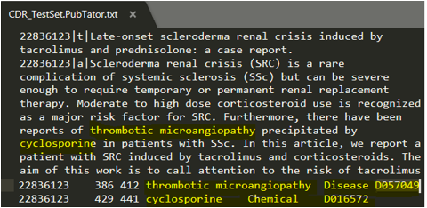
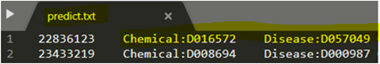
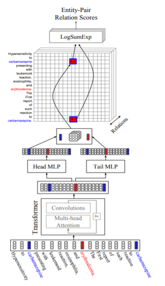
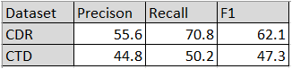
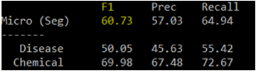

# Simultaneously Self-attending to All Mentions for Full-Abstract Biological Relation Extraction
This paper can be downloaded from https://www.aclweb.org/anthology/N18-1080

### Citation
Patrick Verga • Emma Strubell • Andrew McCallum

Proceedings of the 2018 Conference of the North American Chapter of the Association for Computational Linguistics: Human Language Technologies, Volume 1 (Long Papers)

### Requirements  
python version 2.7
tensorflow version 1.0.1

### Input
CDR (Biocreative V Chemical Disease Relation) data
(paragraph with Chemical-Disease entity relation mentions).

### Output
Predicts ‘Chemical-Disease’ relationship.

### Approach
Bi-affine Relation Attention Networks.
1. Transformer
2. Multilayer Perceptron
3. Bi-affine Pairwise Scores 
4. Entity Level Prediction
5. Named Entity Recognition

### Execution Modes
Train, Predict, Evaluate
Save and Load Model

### Directory location - ditk/entity_linkage/typing/bran

### Process the CDR dataset 
    
####  - Process train, dev, and test data: 
src/processing/utils/process_CDR_data.py
using data/cdr/word_piece_vocabs/just_train_2500/word_pieces.txt

####  - Process including additional weakly labeled data   
src/processing/utils/process_CDR_data.py
using data/cdr/word_piece_vocabs/train_peng_10000/word_pieces.txt

These scripts will use byte-pair encoding (BPE) tokenization. There are also scripts to tokenize using the Genia tokenizer.

####  - Filter Hypernyms
src/processing/utils/filter_hypernyms.py

####  - Convert processed data to tensorflow protobufs
src/processing/labled_tsv_to_tfrecords.py

####  - Convert ner data to tf protos
src/processing/ner_to_tfrecords.py 

### Train and Save Model
src/train_multiclass_classifier.py

### Predict
src/predict.py

### Evaluation
src/evaluate.py

### Save Model - best model will be saved
src/train_multiclass_classifier.py

### Load Model
src/train_multiclass_classifier.py --load_model path/to/model.tf

### Pretrained Models
You can download some pretrained models [here](https://goo.gl/X9umaB)
Folder LOG_DIR contains the saved model when it is trained using the code present in the github.

### Benchmark Datasets used:
 1. Biocreative V Chemical Disease Relation benchmark (CDR)
 2. Chemical Toxicology Database (CTD)
 
 
 
 ### Evaluation metrics:
 - Precision
 - Recall
 - F1

 ### Evaluation results: 
 
 
 
 
 
 
 
 ### Jupyter notebook demo:
 [Jupyter Notebook demo](bran_demo.ipynb)
 
 
 
 ### Demo video:
 [Overview and demo](https://youtu.be/FIkJyJT9qCE)
 
  
