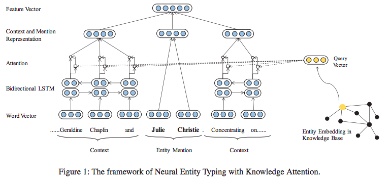

# Improving neural fine-grained entity typing with knowledge attention

This repo is based on the following paper and Github implementation:

*   Xin, Ji and Lin, Yankai and Liu, Zhiyuan and Sun, Maosong. *Improving neural fine-grained entity typing with knowledge attention.* *Thirty-Second AAAI Conference on Artificial Intelligence*, Hilton New Orleans Riverside, New Orleans, 2018. [pdf](https://aaai.org/ocs/index.php/AAAI/AAAI18/paper/view/16321/16167).
*   https://github.com/thunlp/KNET

## Prerequisite

- Actual code on python 2.7.6 [GitHub](https://github.com/thunlp/KNET). This code converted for python 3
- numpy >=1.13.3
- tensorflow 0.12.1
  - Find specific machine TensorFlow version from the follwoing link
    - https://chromium.googlesource.com/external/github.com/tensorflow/tensorflow/+/r0.12/tensorflow/g3doc/get_started/os_setup.md

## Input/Output format for prediction

**Input:**

- text file containing sentence in following format:
  
  - <start_pos>\t<end_pos>\t< sentence>\t<ground_truth>
  
  - Sample Input
  
    ```
    1	3	California Los Angeles beautiful city	Location
    4	8	He received the 1921 Nobel Prize in Physics for his services to theoretical physics	misc
    1	3	Is New York a beautiful city	Location
    ```

**Output**:

- \<entity>\t<ground_truth>\t<predicted_output>

- Sample Output

- ```
  Los Angeles	location	art
  Nobel Prize in Physics	misc	misc
  New York	location	location
  ```

## Input format for training

- For Training purpose it requires the following files:
  - types
  - disamb_file
  - embedding.npy
  - glove.840B.300d.txt
  - Context file for train
  - Entity file for train
  - Fbid for train
  - Label for train
  - Context file to validate
  - Entity file to validate
  - Fbid to validate
  - Label to validate
- To run the code, sample of above files can be found in following link:
  - https://drive.google.com/open?id=1s59j28nl7mjDxcwhSUBLWn13_hnrLXqL
- To run on full train data download files from this two links:
  - https://drive.google.com/file/d/1I6h-k2w_ppQ7ASd7wanYfkCfKp0tnSe0/view?usp=sharing
  - http://nlp.stanford.edu/data/glove.840B.300d.zip

## Approach

Given a sentence which contains an entity mention and its context, model aims to predict the probability of each type for this entity mention. The sentence is a sequence of words s = {..., l2, l1, m1, m2, ..., r1, r2, …}. For each word, we use bold face to denote its corresponding word vector. For each entity mention, our model builds a feature **vector x** to infer the probability of each type by computing an entity type **vector y**.

It consists of 2 parts:

- **Sentence Encoder**
  - Our model transforms word vectors into representations for entity mention and context with neural networks
  - Entity mention representation of entity mention is simply computed by averaging the word vectors of entity mention words {m1, m2, m3, …}.
  - Context representation uses Bidirectional LSTM and attention mechanism to encode context representation. Word vectors of context words {..., l3, l2, l1} and {r1, r2, r3, ...} are fed into the LSTM, and context representation c is the weighted sum of the LSTM outputs.
- **Type Predictor**
  - The **type vector y** is computed from sentence vector x through a two-layer Multi-Layer Perceptron (MLP). Each entry of y indicates the predicted probability of the type for given entity mention.




## Benchmark datasets

- Wiki-Man
- Wiki-Auto

## Evaluation metrics and results

### Testing reuslts on Paper Dataset

<table>
    <thead>
        <tr>
            <th></th>
            <th style="text-align: center;">Strict</th>
            <th colspan="3" style="text-align: center;">Macro</th>
            <th colspan="3" style="text-align: center;">Micro</th>
        </tr>
    </thead>
    <tbody>
        <tr>
            <td></td>
            <td style="text-align: center;">Accuracy</td>
            <td style="text-align: center;">Precision</td>
            <td style="text-align: center;">Recall</td>
            <td style="text-align: center;">F1</td>
            <td style="text-align: center;">Precision</td>
            <td style="text-align: center;">Recall</td>
            <td style="text-align: center;">F1</td>
        </tr>
        <tr>
            <td>Wiki-Auto</td>
            <td style="text-align: center;">0.4720</td>
            <td style="text-align: center;">0.7572</td>
            <td style="text-align: center;">0.7403</td>
            <td style="text-align: center;">0.7487</td>
            <td style="text-align: center;">0.7796</td>
            <td style="text-align: center;">0.7787</td>
            <td style="text-align: center;">0.7792</td>
        </tr>
        <tr>
            <td>Wiki-Man</td>
            <td style="text-align: center;">0.3400</td>
            <td style="text-align: center;">0.6841</td>
            <td style="text-align: center;">0.8283</td>
            <td style="text-align: center;">0.7494</td>
            <td style="text-align: center;">0.6612</td>
            <td style="text-align: center;">0.8750</td>
            <td style="text-align: center;">0.7532</td>
        </tr>
    </tbody>
</table>


### Testing Results on other dataset

|       | Precision | Recall |   F1   |
| :---: | :-------: | :----: | :----: |
| FIGER |  0.45825  | 0.4582 | 0.4582 |


## Jupyter Notebook

[demo.ipynb](./demo.ipynb)

## YouTube Video

https://youtu.be/X7xcpG0SLv8


 ## To Run

 1. Import the Module from main.py

      ```python
      from main import knet
      ```
    
 2. Create Instanse of the module

      ```python
      knet_instance = knet()
      ```

 3. First call read_dataset() and give all the files required to train in the given order
   - types
   - disamb_file
   - embedding.npy
   - glove
   - Context file for train
   - Entity file for train
   - Fbid for train
   - Label for train
   - Context file to validate
   - Entity file to validate
   - Fbid to validate
   - Label to validate

   ```python
        knet_instance.read_dataset([
          "data/types",
          "data/disamb_file",
          "data/embedding.npy",
          "data/glove.840B.300d.txt",
          "data/train_context.npy",
          "data/train_entity.npy",
          "data/train_fbid.npy",
          "data/train_label.npy",
          "data/valid_context.npy",
          "data/valid_entity.npy",
          "data/valid_fbid.npy",
        "data/valid_label.npy"
      ])
   ```

 4. Dataset information

    - To simply run get the sample files from following link:
      
      - https://drive.google.com/open?id=1s59j28nl7mjDxcwhSUBLWn13_hnrLXqL
    - To run on full train data download files from this two links:
      - https://drive.google.com/file/d/1I6h-k2w_ppQ7ASd7wanYfkCfKp0tnSe0/view?usp=sharing
      - http://nlp.stanford.edu/data/glove.840B.300d.zip
    - **Note**: After extracting unzip all the compressed files in it

 5. To train run the following commands. If already trained you can skip this.

      ```python
      knet_instance.train(None)
      ```

 6. To predict on any sentence give path to file. And each line should contain text in following format:

    - **<start_pos>\t<end_pos>\t< sentence>\t<ground_truth (optional in this case)>**

    - Sample file can be found via this link: https://drive.google.com/file/d/1UI_i4f5ueTN8-Inqg7FESGgSKNbN1ZFG/view?usp=sharing

      ```python
       results = knet_instance.predict(["data/entity_typing_test_input.txt"])
       print(results)
      ```

 7. Evaluate on provided dataset in the predict (step 6)

    - **Note**: In this case ground_truth must be present, 

      ```python
       precision, recall, f1_score = knet_instance.evaluate([])
       print("precision: {}\trecall: {}\tf1: {}".format(precision, recall, f1_score))
      ```
      
    - If ground truth was not given in predict give location of new file in the list
     ```python
    precision, recall, f1_score = knet_instance.evaluate(["data/new_file.txt"])
    print("precision: {}\trecall: {}\tf1: {}".format(precision, recall, f1_score))
     ```

## To Test

To use the input file, output file and test python file in folder [test](./test) to test 
