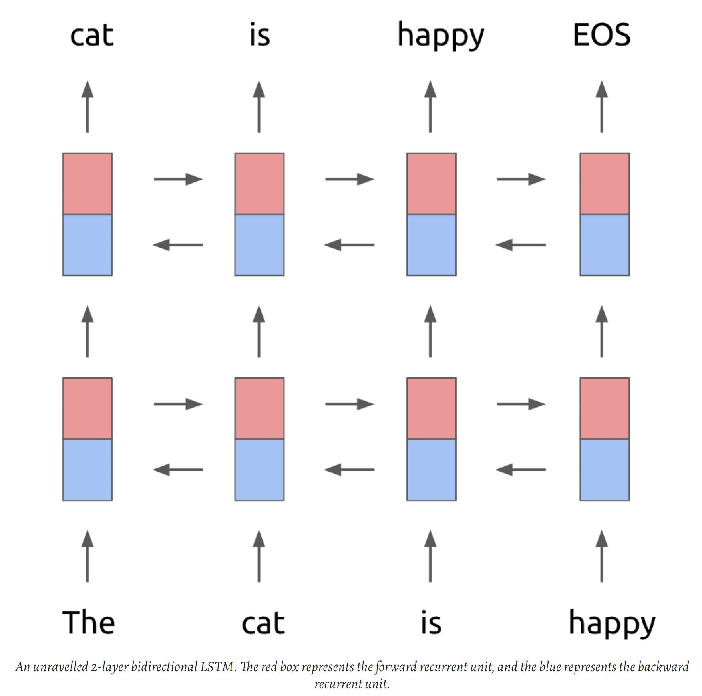
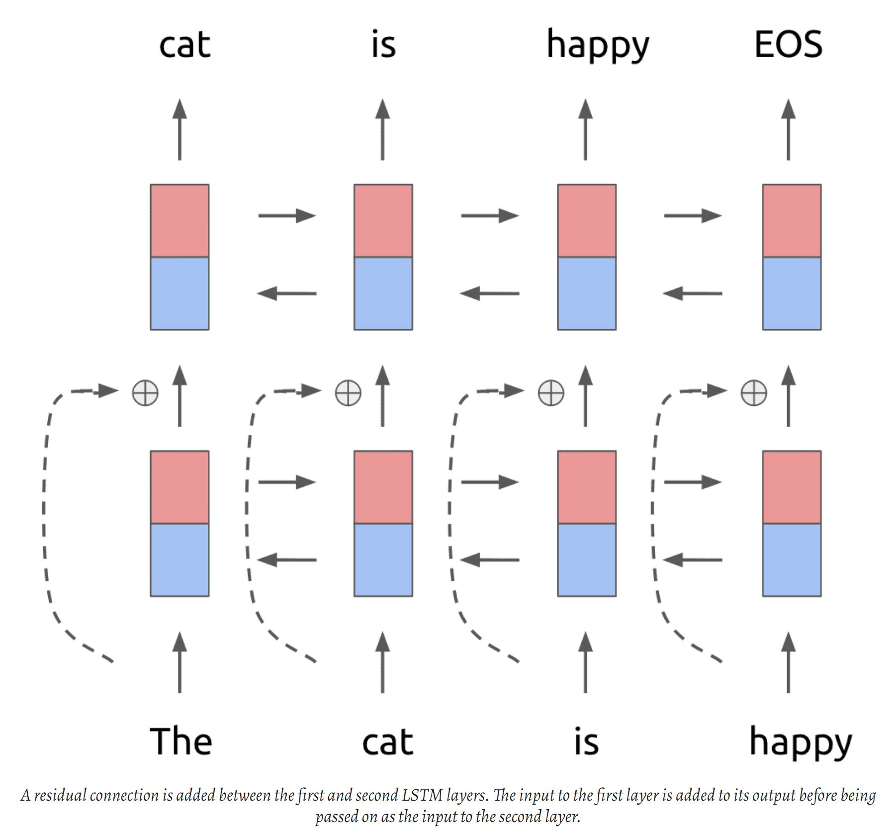
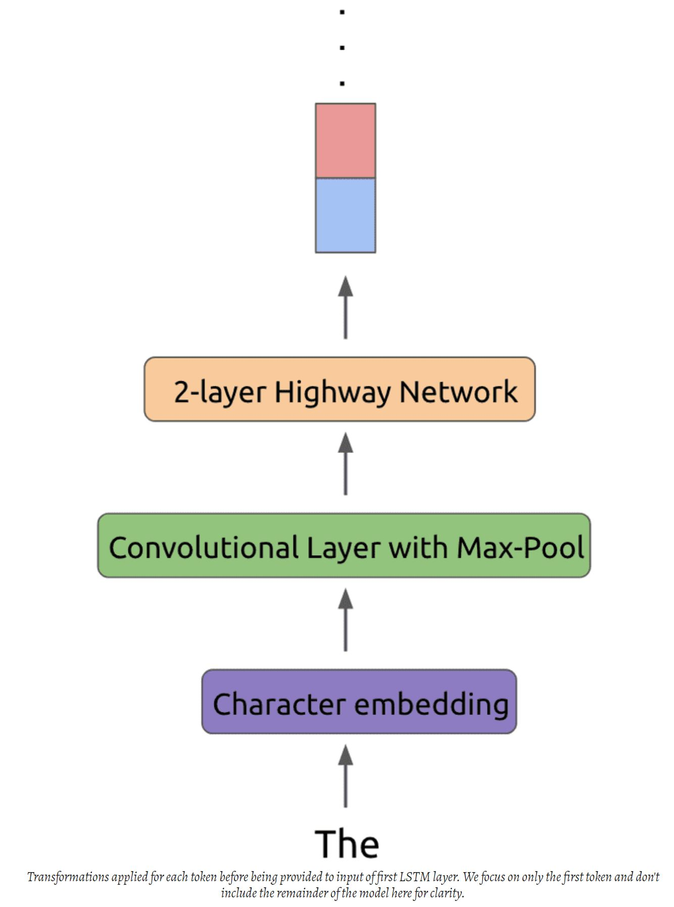
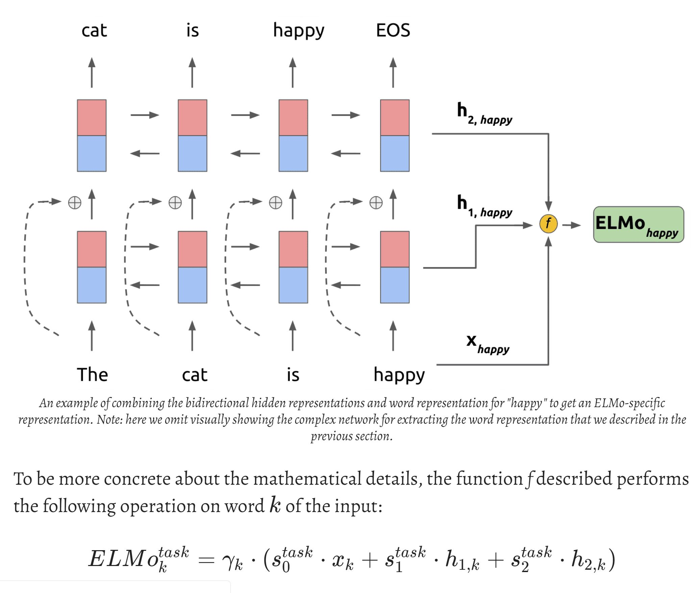
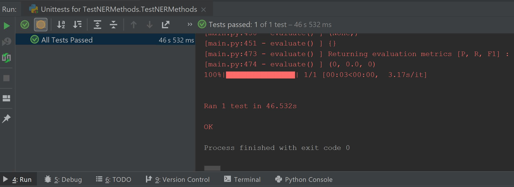

# Deep contextualized word representations

This repo is based on the following paper and Github implementation:

*   Matthew E. Peters • Mark Neumann • Mohit Iyyer • Matt Gardner • Christopher Clark • Kenton Lee • Luke Zettlemoyer • *Deep contextualized word representations* ACL 2015. 
 [pdf](https://arxiv.org/pdf/1802.05365.pdf).
*   https://raw.githubusercontent.com/blackbbc/NER
*   https://github.com/sarveshsparab/DeepElmoEmbedNer

## Prerequisite
- python 3.6
- tensorflow 1.10.0
- numpy 1.14.3
- gensim 3.6.0
- tqdm 4.26.0
  - Find specific machine TensorFlow version from the follwoing link
    - https://chromium.googlesource.com/external/github.com/tensorflow/tensorflow/+/r0.12/tensorflow/g3doc/get_started/os_setup.md

## Input/Output format for prediction

**Input:**

- text file containing sentence in following format:
  
  - \<word\>  \<POS\>   \<Chung tag\>   \<NER tag\>
  
  - Sample Input
  
    ```
    JAPAN   NNP     B-NP    B-LOC
    GET     VB      B-VP    O
    LUCKY   NNP     B-NP    O
    WIN     NNP     I-NP    O
    ```

**Output**:

- \<word\>  \<ground_truth\>    \<predicted_output\>

- Sample Output

- ```
    JAPAN   B-LOC   B-LOC
    GET     O       O
    LUCKY   O       O
    WIN     O       O
  ```

## Input format for training

- For Training purpose it requires the following files:
  - train/test/dev dataset in input files
  - glove.6B.50d.txt
1. Download pre-trained word vector from [http://nlp.stanford.edu/data/glove.6B.zip](http://nlp.stanford.edu/data/glove.6B.zip), unzip `glove.6B.50d.txt` to `resources/pretrained/glove`.
2. Download pre-trained elmo models [elmo_2x1024_128_2048cnn_1xhighway_weights.hdf5](https://s3-us-west-2.amazonaws.com/allennlp/models/elmo/2x1024_128_2048cnn_1xhighway/elmo_2x1024_128_2048cnn_1xhighway_weights.hdf5) and [elmo_2x1024_128_2048cnn_1xhighway_options.json](https://s3-us-west-2.amazonaws.com/allennlp/models/elmo/2x1024_128_2048cnn_1xhighway/elmo_2x1024_128_2048cnn_1xhighway_options.json), put them in `resources/elmo`.

## Approach

- Tokenize the input and fetch the glove representations for each token
- Feed these tokenized sentences in the reverse order into model. This paper uses a stacked, multi-layer(L) LSTM. Whereas a single-layer LSTM would take the sequence of words as input, a multi-layer LSTM trains multiple LSTMs to take the output sequence of the LSTM in the previous layer as input
- Add the original word vectors, we have 2L + 1 vectors that can be used to compute the context representation of every word
- Using these word representations the CRF layer estimates the best tag candidate with highest probability.










[Presentation](./notebook/PaperPresentation.pdf)

## Benchmark datasets

- [CoNLL 2003](https://www.clips.uantwerpen.be/conll2003/ner/)

## Evaluation metrics and results

| Model  | Dataset    | Test F1 |
| :----: | :-------:  | :-----: | 
| Peters et. al | CoNLL 2003 | 92.22(+/-0.10)   |
| Ours          | CoNLL 2003 | 92.23   |

## Jupyter Notebook

[DeepElmoEmbedNer.ipynb](./notebook/DeepElmoEmbedNer.ipynb)

## YouTube Video

[Video Link](http://bit.ly/2ZP91QO)


 ## To Run

 1. Import the Module from main.py

    ```python
    from model.main import DeepElmoEmbedNer
    ```
    
 2. Create Instance of the module

    ```python
    deen = DeepElmoEmbedNer()
    ```

 3. First call read_dataset() and give all the files required to train in the given order
   - file_dict
   - dataset_name
   *Refer [notebook](./notebook/DeepElmoEmbedNer.ipynb) for details on additional parameters*

        ```python
        file_dict = dict()
        file_dict['train'] = './data/sample/ner_test_input.txt'
        file_dict['test'] = './data/sample/ner_test_input.txt'
        file_dict['dev'] = './data/sample/ner_test_input.txt'
        
        data = deen.read_dataset( file_dict, "CoNLL03" )
        ```

 4. To train run the following commands. If already trained you can skip this.
    Parameters needed in order
    - data
    *Refer [notebook](./notebook/DeepElmoEmbedNer.ipynb) for details on additional parameters*
    
        ```python
        model, sess, saver = deen.train(data)
        ```

 5. To predict on any sentence give path to file.
    Parameters needed in order
    - Test file path
    *Refer [notebook](./notebook/DeepElmoEmbedNer.ipynb) for details on additional parameters*

    And each line should contain text in following format:
    - **\<word\>  \<POS\>   \<Chung tag\>   \<NER tag\>**
    - Sample file in the correct format can be found [here](data/sample/ner_test_input.txt)

        ```python
        predictions = deen.predict(test_file_path, writeInputToFile=False, model=model, sess=sess, saver=saver, trainedData=data['train'])
        print(predictions)
        ```

 6. Evaluate on provided dataset in the predict
    Parameters needed in order
    - predictions
    - groundTruths
    *Refer [notebook](./notebook/DeepElmoEmbedNer.ipynb) for details on additional parameters*
    - **Note**: In this case ground_truth must be present, or can be generated with the *convert_ground_truth* method 

      ```python
       precision, recall, f1_score = deen.evaluate(predictions, groundTruths)
       print("precision: {}\trecall: {}\tf1: {}".format(precision, recall, f1_score))
      ```

## To Test
Custom test-case added to ensure proper working of the code

To use the input file, output file and test python file in folder [tests](./tests) to test 



## Info & Acknowledgement
This code is modelled based on another [implementation](https://raw.githubusercontent.com/blackbbc/NER) of the research paper.
This is repository is part of the [DITK](https://github.com/data-integration-toolkit/ditk) project as per the [USC CSCI 548, Spring '19](https://classes.usc.edu/term-20191/course/csci-548/) graduate course.
Please email your questions or comments to [Sarvesh Parab](http://www.sarveshparab.com/).
