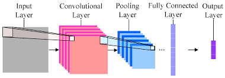
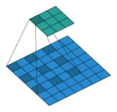

# UOI
- Title of the paper

    **Fast and Accurate Entity Recognition with Iterated Dilated Convolutions**
- Full citation


    Fast and Accurate Sequence Labeling with Iterated Dilated Convolution
    Emma Strubell, Patrick Verga, David Belanger, Andrew McCallum
    In Conference on Empirical Methods in Natural Language Processing (EMNLP). Copenhagen, Denmark. September 2017


## Original Code
Github URL of the original code
	[https://github.com/iesl/dilated-cnn-ner](https://github.com/iesl/dilated-cnn-ner)

## Description  
    1. The paper's task is to do Named Entity Recognition on Conll2003, 
    2. The model is based on Iterated Dilated Convorlutional Neural Networks
    3. ID-CNNs permit fixed-depth convolutions to run in parallel across entire documents
    4. The model can predict each token’s label independently, or by running Viterbi inference in a chain structured graphical model.
    5. The model contains 3 layers. The first layer has dilation 1 width 3, the second layer has dilation 2 width 3 and the last layer has dilation 1 width 3
    6. It uses Bi-LSTM for char embedding


*Convolutions Neural Networks*

*Dilated Convolutions Neural Networks*

## Dependency
- Python
- Keras
- TensorFlow
## Resources
### [GloVe](https://nlp.stanford.edu/projects/glove/)
_GloVe is an unsupervised learning algorithm for obtaining vector representations for words. 
Training is performed on aggregated global word-word co-occurrence statistics from a corpus, 
and the resulting representations showcase interesting linear substructures of the word vector space._
### [CoNLL 2003](https://www.clips.uantwerpen.be/conll2003/ner/)
_The shared task of CoNLL-2003 concerns language-independent named entity recognition. 
We will concentrate on four types of named entities: persons, locations, 
organizations and names of miscellaneous entities that do not belong to the previous three groups._ 
## Input and Output
### Input and output for prediction
#### Input
The input file should follow the format of [Conll2012](http://conll.cemantix.org/2012/data.html). 
However, only the first 4 columns are used.

```(the word, POS tag, Chunk tag, Named entity tag)```

For example:

``Katleen NNP I-NP B-PER``
#### Output
   The output for prediction contains 3 columns
   
   ```(Token, Ground truth, Prediction)```
   
   For example:
   
   ```first B-ORDINAL B-ORDINAL```
### Input and output for Training
#### Input for training
The input for training should have the same format as prediction, where contains at least four columns ```(the word, POS tag, Chunk tag, Named entity tag)```.
#### Output for training
The output for training is model files stored under `models` folder which is the parameters for **ID-CNN**.
## Evaluation
### Benchmark datasets
[Conll2003](https://www.clips.uantwerpen.be/conll2003/ner/), [Ontonotes](https://catalog.ldc.upenn.edu/LDC2013T19), [CHEMDNER](https://jcheminf.biomedcentral.com/articles/10.1186/1758-2946-7-S1-S2)
- Evaluation metrics and results

|Data set |Recall|Precision | F1 |
|---------|------|----------|----|
|Conll2003|  0.88|     0.89 |0.88|
|Ontonotes|  0.73|     0.73 |0.73|
|CHEMDNER|   0.68|     0.68 |0.69|
## Repository Structure 
**This is the files on my local machine after training. Files are different from your machine** 
```
.
├── CoNNL2003eng  #This is for training data
│   ├── conll2003-w3-lample  #Auto-generate folder. It shoud be empty before reading the dataset.
│   │   ├── test.txt
│   │   │   ├── char.txt
│   │   │   ├── examples.proto
│   │   │   ├── label.txt
│   │   │   ├── shape.txt
│   │   │   ├── sizes.txt
│   │   │   └── token.txt
│   │   ├── train.txt
│   │   │   ├── char.txt
│   │   │   ├── examples.proto
│   │   │   ├── label.txt
│   │   │   ├── shape.txt
│   │   │   ├── sizes.txt
│   │   │   └── token.txt
│   │   └── valid.txt
│   │       ├── char.txt
│   │       ├── examples.proto
│   │       ├── label.txt
│   │       ├── shape.txt
│   │       ├── sizes.txt
│   │       └── token.txt
│   ├── models #Autogenerated folder. It should be empty before training
│   │   ├── checkpoint
│   │   ├── dilated-cnn
│   │   │   └── graph.pbtxt
│   │   ├── dilated-cnn.tf.data-00000-of-00001
│   │   ├── dilated-cnn.tf.index
│   │   └── dilated-cnn.tf.meta
│   ├── test.txt  #Test dataset from CoNLL2003
│   ├── train.txt #Train dataset from CoNLL 2003
│   ├── valid.txt #Valid dataset from CoNLL 2003 
│   └── vocabs #Autogenerated file. It should be empty before reading dataset
│       └── conll2003_cutoff_4.txt
├── DilatedCNN.ipynb #Notebook for demostrating how to use it
├── Ner.py #My implementation for the paper
├── README.md
├── Recipe.txt
├── cnn.png
├── dilated
├── embedding #Embedding file from GloVe
│   └── glove.6B.100d.txt
├── main.py #Main file
├── requirements.txt
├── src #Source codes from the paper
│   ├── bilstm.py #For char embedding
│   ├── bilstm_char.py #For char embedding
│   ├── cnn.py #CNN 
│   ├── cnn_char.py #Not used in my approach
│   ├── data_utils.py  #Utility class
│   ├── eval_f1.py #Evaluation class
│   ├── preprocess.py #Word embedding class
│   ├── tf_utils.py  #TensorFlow Utility
│   ├── train.py #For training
│   ├── tsv_to_tfrecords.py #For embedding
│   └── tsv_to_tfrecords_ontonotes.py #For embedding ontonotes
└── tests #Test cases
    ├── eval.txt  #Evaluation result
    ├── labels.txt #Ouput file
    └── paper1_test.py #Unit test
``
## Demo
- [Notebook](DilatedCNN.ipynb) 
- [Youtube](https://www.youtube.com/watch?v=QrIJygmQ2Ag)

## How to run the source code
### Download the dataset
In order to run the source code, the user should download a dataset as well as an embedding file.
The dataset can be download from [here](https://github.com/synalp/NER/tree/master/corpus/CoNLL-2003). 
After download the dataset, the user should put 3 text files, i.e. `test.txt`, `train.txt` and `valid.txt`
to the folder `CoNNL2003eng` and `embedding`. The folders, currently, contain sample files for guiding user to put
the current files so please overwrite the sample files.

### Python version and Tensorflow version
The user should make sure the version of Python>=3 and Tensorflow>=1.13.1

### Read the dataset
The first step is to read the dataset. The codes are as following. Please **replace** the paths by your local paths
```python
from extraction.named_entity.yiran.paper1 import Ner
d = Ner.DilatedCNN()
total_training_sample = d.read_dataset(input_files=['/home/ubuntu/dilated-cnn-ner/data/conll2003/eng.train','/home/ubuntu/dilated-cnn-ner/data/conll2003/eng.testa','/home/ubuntu/dilated-cnn-ner/data/conll2003/eng.testb'], 
                                        embedding='./data/embeddings/glove.6B.100d.txt') 
```

### Train the model
After reading the dataset, we can start to train the model. 
There will be a file added `model.h5` will be created so **please confirm python have the privilege to create a file.**
```python
d.train(data=None)

```

### Predict the files
After having model trained, we can try to predict new sentences.
```python
predict_file='dataset/CoNNL2003eng/test.txt'
result = d.predict('/home/ubuntu/dilated-cnn-ner/data/conll2003-w3-lample/eng.testb')
```
Now, we have the `tokens`, `ground_truth_tags` and `predictions`

## Reference


``
Jeffrey Pennington, Richard Socher, and Christopher D. Manning. 2014. GloVe: Global Vectors for Word Representation.
``

``
CONLL '03 Proceedings of the seventh conference on Natural language learning at HLT-NAACL 2003 - Volume 4
``

