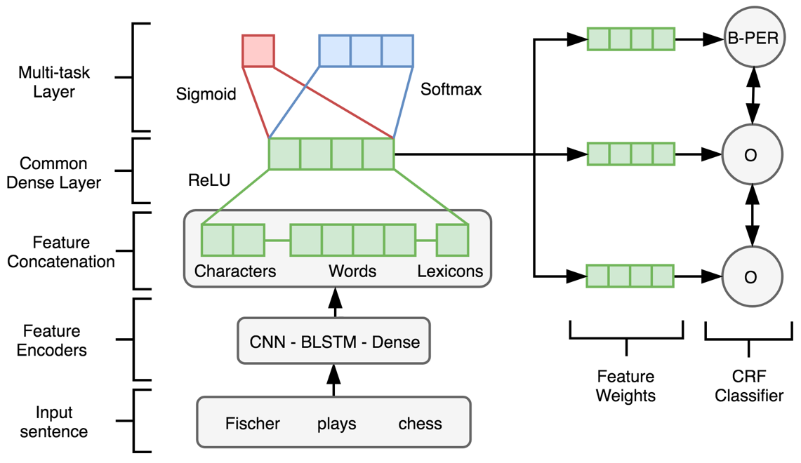

# Multi-Task NER
## Paper Title
- A Multi-task Approach for Named Entity Recognition in Social Media Data
## Full Citation
- Aguilar, Gustavo, et al. "A multi-task approach for named entity recognition in social media data." Proceedings of the 3rd Workshop on Noisy User-generated Text. 2017.

## Original Code
https://github.com/gaguilar/NER-WNUT17

## Description
- This project recognizes named entities from sentences with a multi-task neural network. This network is trained with two tasks: named entity segmentation task and named entity classification task. To train the model, it takes orthographic, word and lexicon features of words with pre-trained embeddings. In addition to the neural network classifier, to employ the sequential information of sentences, a conditional random field classifier is applied to predict classes.

- The inputs accpected by the project should be in the format as conll2012, while the trainer only needs words, words' Part-of-Speech tags and entity tags.

- The outputs of this project will in format as (word, target entity tag, predicted entity tag).
## Functions

- The project can read datasets (read_dataset) and encode data for named entity recognition task (generating_encoding)

- The project can build a multi-task neural network trained to identify and classify named entities in sentences (train)

- The project can load (load_model) and save (save_model) model.

- The project can predict the words' entity tags given sentences (predict).

- The project can evaluate the predictions with target tags (evaluate).

- Note that one pre-trained embedding is too large to include in this project, please download the Twitter Word2vec model from http://fredericgodin.com/software/ and place it under the embeddings/twitter folder

This downloaded zip contains a word2vec model trained on Twitter data as described in:
```
Godin, F., Vandersmissen, B., De Neve, W., & Van de Walle, R. (2015).
Multimedia Lab @ ACL W-NUT NER shared task: Named entity recognition for Twitter microposts using distributed word representations.
Workshop on Noisy User-generated Text, ACL 2015.
```
and the code is modified by the authors of the paper

## Overall Structure


## Dependencies
- pandas==0.24.2
- paramiko==2.4.2
- tensorflow==1.13.1
- numpy==1.16.2
- gensim==3.7.1
- scipy==1.2.1
- python_crfsuite==0.9.6
- scikit_learn==0.20.3

## Resources:

- Pre-trained Twitter Word Embeddings from Godin et al., (2015).

- Gazetteer files from Mishra and Diesner (2016).

## Input and Output
### Prediction
- Input: (word, POS tag, entity tag) tuples from data in conll2012 format
- Output: (word, target entity tag, predicted entity tag) tuples
### Training
- Input: (word, POS tag, entity tag) tuples
- Output: parameters of the trained neural network, the model will be saved in a pre-defined folder

## Evalution
### Benchmark datasets
- WNUT17: a dataset from the 3rd Workshop on Noisy User-generated Text. Six classes in this dataset: Person, Location, Corporation, Product, Creative work and Group. 
- Conll2003: data from different resources. Four classes are Person, Organization, Location and Miscellaneous entities
- OntoNotes5.0: data from multiple resources. Eighteen classes: Person, NORP, FACILITY, ORGANIZATION, GPE, LOCATION, PRODUCT, EVENT, WORK OF ART, LAW, LANGUAGE, DATE, TIME, PERCENT, MONEY, QUANTITY, ORDINAL, AND CARDINAL
- Chemdner: data about bio-medical. Eight classes: SYSTEMATIC, IDENTIFIERS, FORMULA, TRIVIAL, ABBREVIATION, FAMILY, CLASS and MULTIPLE.
### Evaluation metrics
- Precision
- Recall
- F1-Score
### Results
Benchmark     | Precision | Recall | F1-Score | 
------------- | --------- | ------ | -------- | 
WNUT17        |   0.58    |  0.32  |   0.41	  |   
Conll2003     |   0.85    |  0.88  |   0.87	  |     
OntoNotes5.0  |   0.71    |  0.69  |   0.68   |     
Chemdner      |   0.60    |  0.49  |   0.54   |   

## Repository Structure
```
 MultiTaskNER/
|__ main.py --> invoke the entire project
|__ MultiTaskNER.iphnb --> jupyter notebook illustrating functions
|__Multi_Task_NER.py --> the class implemented for the project
|__ data --> the folder where data files should be placed
|__ common/
    |__ representation.py --> functions to encode data
    |__ utilities.py --> functions needed to preprocess data, etc
|__ embeddings/
    |__ twitter/
        |__ word2vec_twitter_model.bin (should be downloaded online)
        |__ word2vecReader.py
        |__ word2vecReaderUtils.py
        |__ README.md
    |__ gazetters/
        |__ one.token.check.emb 
|__ models/
    |__ crf.py --> model to build CRF classifier
    |__ network.py --> model to build neural network classifier
|__ tests/
    |__ NER_test.py --> unittest of the project
    |__ ner_test_input/ --> data used for unittest
        |__ train.txt
        |__ valid.txt
        |__ test.txt
|__ Pic
    |__ Picture1.png --> the model strucutre
|__ requirements.txt --> required packages
|__ settings.py --> global settings
|__ recipe.txt --> the link of the project and the implemented classes
```
## How to run it
- In the main.py, give the path of train, validation and test datafiles.
- The input files should be passed together in a dictionary, like
```
fileNames = {}
fileNames['train'] = "train.txt"
fileNames['valid'] = "valid.txt"
fileNames['test'] = "test.txt"
```
- The output will be in the format as (word, target tag, predicted tag)
```
the B-FAC B-FAC
Country I-FAC I-FAC
Music I-FAC I-FAC
Awards I-FAC I-FAC
```
- The project will be invoked by simply running the main.py
- The functions including read_dataset, generating_encoding, train, save_model, predict and evaluate will be executed in order.
- To adjust the neural netowrk settings, change the parameters in network.py under models folder.

## Demo

- [Sample notebook](./multi_task_ner.ipynb)
- [Demo video](https://youtu.be/cuDJFMKsl3s)

## Reference
The reference required by the authors of the original project
```
@inproceedings{aguilar-EtAl:2017:WNUT,
    title = {A Multi-task Approach for Named Entity Recognition on Social Media Data},
    author = {Gustavo Aguilar, Suraj Maharjan, A. Pastor López Monroy, Thamar Solorio},
    url = {http://www.aclweb.org/anthology/W17-4419},
    year = {2017},
    date = {2017-09-07},
    publisher = {Proceedings of 3rd Workshop on Noisy User-generated Text, WNUT 2017.},
    note = {Ranked 1st place in the two evaluation metrics},
    keywords = {CRF, Deeplearning, Multitask, NER},
    pubstate = {published},
    tppubtype = {inproceedings}
}
```