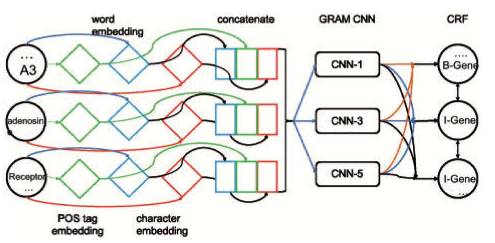

GRAM-CNN
===================
- GRAM-CNN: a deep learning approach with local context for named entity recognition in biomedical text.
- Zhu, Qile, et al. GRAM-CNN: a deep learning approach with local context for named entity recognition in biomedical text. Bioinformatics 34.9 (2017): 1547-1554. [link to original paper](https://academic.oup.com/bioinformatics/article-pdf/34/9/1547/25120965/btx815.pdf)

## Original Code
[https://github.com/valdersoul/GRAM-CNN](https://github.com/valdersoul/GRAM-CNN)

## Description
- The paper using CNN to predict the biomedical name entity with the following method
- Concatenate POS Tag embedding, word embedding and character embedding as input features of GRAM-CNN
- Extract local information and n-gram features without breaking the internal relation between embeddings in GRAM-CNN
- Max pooling the output of CNN to maintain sequence-to-sequence network.
- Feed in a CRF to find the max probability of entity candidates using Viterbi Algorithm
- Network Model
 
 
 
## Input / Output Format

-  Input format: Sentence 
	- `Salivary immunoglobulin was determined on 3 occasions.`
-  Output format: Sentence with name entity 
-  	`[(Salivary, B-Protein),(immunoglobulin, I-Protein),(was, O), (determined, 0), (on, 0), (3, 0), (occasions, 0)]`
    
## Evalution
- Benchmark Datasets
    - CHEMDNER
- Evaluation metrics
    - Precision
    - Recall
    - F-1 score
- Results (Test set)

| Dataset | Precision | Recall | F-1 score | 
| :--- | :---: | :---: | :---: | 
| CHEMDNER | 52.85% | 37.05% | 43.56% | 

## Demo
- [Sample notebook](./demo.ipynb)
- [Demo video](https://youtu.be/A3CEvaD7Epo)

