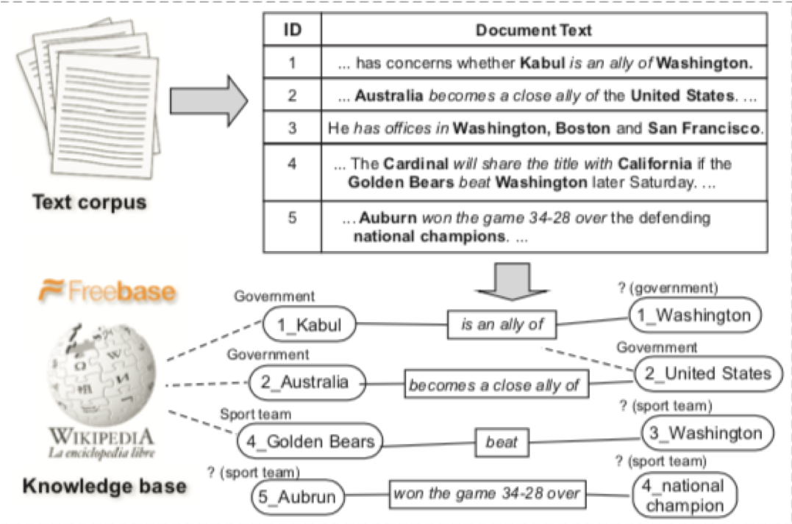
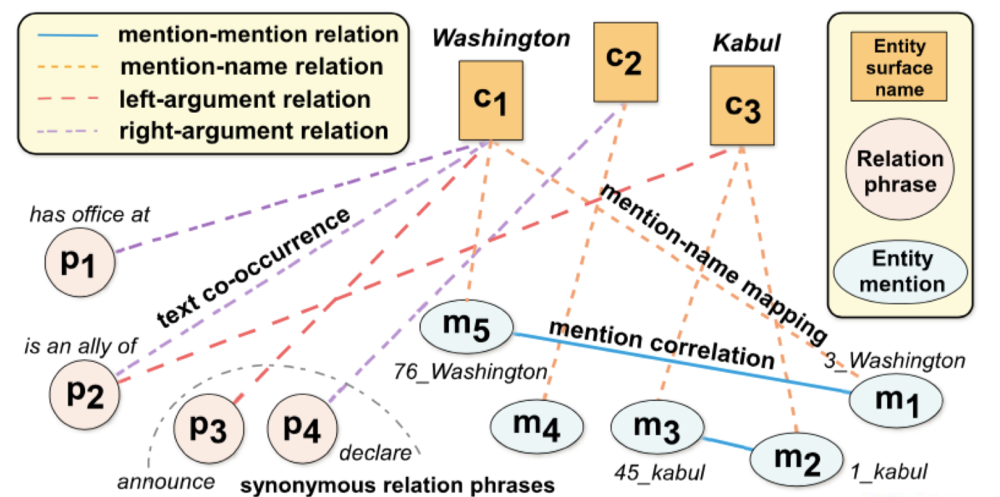

# Clustype: Effective entity recognition and typing by relation phrase-based clustering.

This repo is based on the following paper and Github implementation:

*   Ren, Xiang and El-Kishky, Ahmed and Wang, Chi and Tao, Fangbo and Voss, Clare R and Han, Jiawei. Clustype: Effective entity recognition and typing by relation phrase-based clustering. Proceedings of the 21th ACM SIGKDD International Conference on Knowledge Discovery and Data Mining: 995-1004, 2015. doi:10.1145/2783258.2783362 [link](http://web.engr.illinois.edu/~xren7/fp611-ren.pdf).
*   https://github.com/INK-USC/ClusType

## Dependencies

- python 2.7
- numpy, scipy, scikit-learn, lxml, TextBlob and related corpora

```
$ sudo pip install numpy scipy sklearn lxml textblob
$ sudo python -m textblob.download_corpora
```

## Input format for training/prediction

- The input format is generalized for the whole NER group

  - It contains multiple columns got from CoNLL 2003 and CoNLL 2012 (separated by space)

  - Sample

  - ```
    Yes UH (TOP(S(INTJ*) O bc/cnn/00/cnn_0003 0 0 - - - Linda_Hamilton * -
    they PRP (NP*) O bc/cnn/00/cnn_0003 0 1 - - - Linda_Hamilton * (15)
    did VBD (VP*) O bc/cnn/00/cnn_0003 0 2 do 01 - Linda_Hamilton (V*) -
    ```

- With this it also needs freebase base mapping [Link](https://drive.google.com/file/d/0Bw2KHcvHhx-gQ2RJVVJLSHJGYlk/view).

## Approach




- Generate all the candidates for entities using POS

- Using DBPedia Spotlight and Freebase it finds confidently known types

- Using the known entities from DBPedia, unknown entities and relation between entities it generates a Graph

  

  

- Using the graph it predict the type of the new mentions by clustering similar relations together

## Benchmark datasets

- NYT
- Tweets
- Yelp

## Evaluation metrics and results

|            | **Precision** | **Recall** |   F1   |
| :--------: | :-----------: | :--------: | :----: |
|  **NYT**   |    0.8437     |   0.9075   | 0.8744 |
|  **Yelp**  |    0.7825     |   0.7497   | 0.7657 |
| **Tweet**  |    0.3776     |   0.3222   | 0.3477 |
| ***CoNLL** |       0       |     0      |   0    |

**Note:** 

- These values are calculated for 40 randomly chosen sentences so it may be different when calculated again

- **(*)**Since this project uses relationship between 2 entities to predict the entity and entity type, thats why Group decided dataset CoNLL, OntoNotes are not suited for it

## Jupyter Notebook

[demo.ipynb](./demo.ipynb)

## YouTube Video

https://youtu.be/bu0K0JNfkq4

## To Run

1. Import the Module from main.py

   ```python
   from main import ClustType
   ```

2. Create Instanse of the module

   ```python
   clustType_instance = ClustType()
   ```

3. First call read_dataset() and give all the files required to train in the given order

   - input files for test, dev and train
   - freebase_links.nt [Link](https://drive.google.com/file/d/0Bw2KHcvHhx-gQ2RJVVJLSHJGYlk/view)

   ```python
   file_path = {
     "test": "data/ner_test_input.txt",
     "dev": "data/ner_test_input.txt",
     "train": "data/ner_test_input.txt"
   }
   read_data = clustType_instance.read_dataset(file_path, "CoNLL", freebase_link="data/freebase_links.nt")
   ```

4. To train run the following commands. If already trained you can skip this.

   ```python
   clustType_instance.train(read_data)
   ```

5. To predict from the file given above:

   ```python
   output_file = clustType_instance.predict(read_data)
   print "Output file has been created at: {}".format(output_file)
   ```

6. To Evaluate:

   ```python
   precision, recall, f1_score = clustType_instance.evaluate(None, read_data)
   print("precision: {}\trecall: {}\tf1: {}".format(precision, recall, f1_score))
   ```

## To Test

To use the input file, output file and test python file in folder [test](./test) to test 
