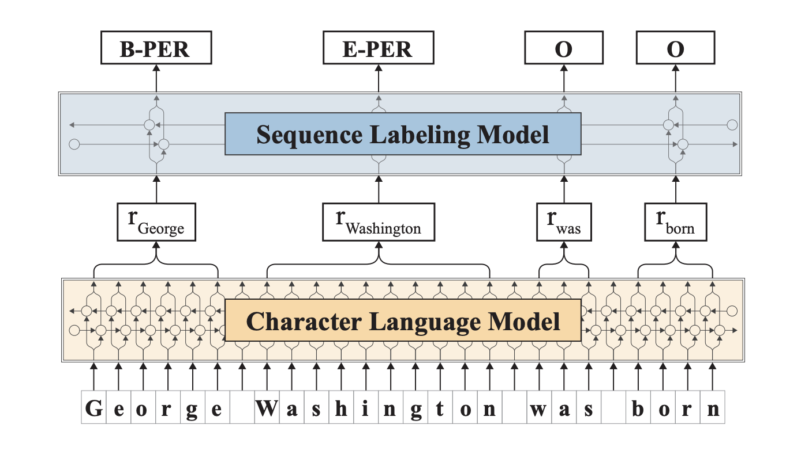

This repo is based on the following paper :

#**Contextual String Embeddings for Sequence Labeling**

paper : **https://www.aclweb.org/anthology/C18-1139**
---
original implementation for reference : **https://github.com/zalandoresearch/flair**
---

## Approach :

1) Propose a new contextualized character-level word embedding – “Contextual string embedding”
2) Base the embeddings on Neural character-level language modeling (Character based LM) 
3) Feed words to Character-level LMàContextual string embeddingàBiLSTM-CRFàTags



## Input / output format : 

The training and test data is expected similar to standard CoNLL-type tab-separated format as indicated. 
One word per line, separate column for token and label, empty line between sentences.


Output format for predict : List of input sentences. The B/I tag and Entity type are added after the mentions that
are discovered.

For eg :
        
        Input sentence : George Washington went to Washington .

        Output sentence : George <B-PER> Washington <E-PER> went to Washington <S-LOC> .

## Quick Start

### Requirements and Installation

The project is based on PyTorch 0.4+ and Python 3.6+, because method signatures and type hints are beautiful.
If you do not have Python 3.6, install it first. [Here is how for Ubuntu 16.04](https://vsupalov.com/developing-with-python3-6-on-ubuntu-16-04/).
Then, in your favorite virtual environment, simply do:

```
pip install flair
```

### Example Usage

Let's run named entity recognition (NER) over an example sentence. All you need to do is make a `Sentence`, load 
a pre-trained model and use it to predict tags for the sentence:

```python
from flair.data import Sentence
from flair.models import SequenceTagger

# make a sentence
sentence = Sentence('I love Berlin .')

# load the NER tagger
tagger = SequenceTagger.load('ner')

# run NER over sentence
tagger.predict(sentence)
```

Done! The `Sentence` now has entity annotations. Print the sentence to see what the tagger found.

```python
print(sentence)
print('The following NER tags are found:')

# iterate over entities and print
for entity in sentence.get_spans('ner'):
    print(entity)
```

This should print: 

```console
Sentence: "I love Berlin ." - 4 Tokens

The following NER tags are found: 

LOC-span [3]: "Berlin"
```
## Code flow
Please refer to the [python notebook](flair_demo.ipynb) for the flow and to know how to invoke the code.

## Benchmark datasets
CoNLL 2003 , Ontonotes 5.0 , CHEMDNER

## Evaluation metrics and results
Due to the immense time it takes for training, I have the results just for CoNLL 2003 dataset.

* Dataset : CoNLL 
* Epochs  : 5 epochs
* F1      : 91.39

## Citation

```
@inproceedings{akbik2018coling,
  title={Contextual String Embeddings for Sequence Labeling},
  author={Akbik, Alan and Blythe, Duncan and Vollgraf, Roland},
  booktitle = {{COLING} 2018, 27th International Conference on Computational Linguistics},
  pages     = {1638--1649},
  year      = {2018}
}
```

### Running unit tests locally

You need [Pipenv](https://pipenv.readthedocs.io/) for this:

```bash
pipenv install --dev && pipenv shell
pytest tests/
```

To run integration tests execute:
```bash
pytest --runintegration tests/
```
The integration tests will train small models.
Afterwards, the trained model will be loaded for prediction.

To also run slow tests, such as loading and using the embeddings provided by flair, you should execute:
```bash
pytest --runslow tests/
```

## Demo

ipython notebook : [Python Notebook](flair_demo.ipynb)

video : [https://youtu.be/zLxYPHKdWao](https://youtu.be/zLxYPHKdWao)


## [License](/LICENSE)

The MIT License (MIT)

Flair is licensed under the following MIT license: The MIT License (MIT) Copyright © 2018 Zalando SE, https://tech.zalando.com

Permission is hereby granted, free of charge, to any person obtaining a copy of this software and associated documentation files (the “Software”), to deal in the Software without restriction, including without limitation the rights to use, copy, modify, merge, publish, distribute, sublicense, and/or sell copies of the Software, and to permit persons to whom the Software is furnished to do so, subject to the following conditions:

The above copyright notice and this permission notice shall be included in all copies or substantial portions of the Software.

THE SOFTWARE IS PROVIDED “AS IS”, WITHOUT WARRANTY OF ANY KIND, EXPRESS OR IMPLIED, INCLUDING BUT NOT LIMITED TO THE WARRANTIES OF MERCHANTABILITY, FITNESS FOR A PARTICULAR PURPOSE AND NONINFRINGEMENT. IN NO EVENT SHALL THE AUTHORS OR COPYRIGHT HOLDERS BE LIABLE FOR ANY CLAIM, DAMAGES OR OTHER LIABILITY, WHETHER IN AN ACTION OF CONTRACT, TORT OR OTHERWISE, ARISING FROM, OUT OF OR IN CONNECTION WITH THE SOFTWARE OR THE USE OR OTHER DEALINGS IN THE SOFTWARE.

