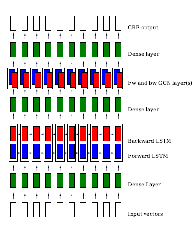

# Graph Convolutional Networks for Named Entity Recognition

- The paper can be dowloaded from https://arxiv.org/pdf/1709.10053.pdf
- Citation: Alberto Cetoli, Stefano Bragaglia, Andrew D. O'Harney, Marc Sloan, 16th International Workshop on Treebanks and Linguistic Theories, January 23 – 24, 2018

## Original Code
Github URL of the original code: https://github.com/ContextScout/gcn_ner

## Description
- Using GCNs and POS tagging to boost the entity recognition of a bidirectional LSTM.
- Measure the impact of using dependency trees for entity classification.
- The paper combines LSTMs, GCN for the NER task and provides the dependency tree and POS tags as input to improve the tagging task.
- The model used is shown in the image below:

## Setup
(Tested on Python 3, Linux based systems.)
- Clone the git repository
- Install the requirements
	- pip install -r requirements.txt
- Run the following commands to configure the spacy library
	- python -m spacy download en
	- python -m spacy download en_core_web_md

## Input and Output
- Prediction
	- Input format is the DITK format
	
	- Output returns predicted entity tags for each word in the data
- Training
	- Input is in CoNLL 2012 format.
	- Output is stored as a model.

## Evalution
- #### Benchmark Datasets
    - OntoNotes 5.0 
- #### Evaluation Metrics
    - Precision
    - Recall
    - F1 score
- #### Evaluation Results
    - Precision: 87.9
    - Recall: 80.83
    - F1 score: 84.22

## Demo
- Link to the Jupyter Notebook 
- Link to the video on Youtube
