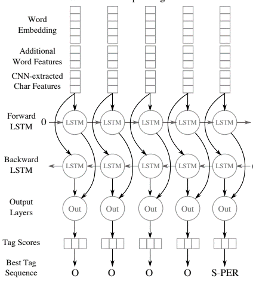
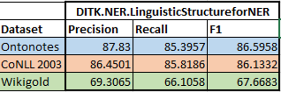

Leveraging Linguistic Structures for Named Entity Recognition with Bidirectional Recursive Neural Networks
===========================================================================================================
This paper can be downloaded from https://aclweb.org/anthology/D17-1282

#### Citation: 
- Peng-Hsuan Li et. al, EMNLP, 2017.

#### Input:
 - Data in DITK.NER format as below - 
 
 
#### Output:
Returns predicted entity tags for each word in the data

#### Setup:
1. Clone the code locally
2. The execution class is located in the root directory file linguisticstructure_ner. 
    Import the LingusticStructureforNER class from linguisticstructure_ner.     
3. The project needs Senna Embeddings, Glove embeddings which can be found at- 
   
   - [Senna Embeddings](https://ronan.collobert.com/senna/)
   - [Glove Word Embeddings](http://nlp.stanford.edu/data/glove.42B.300d.zip)
   
4. Read the dataset in the DITK format by passing in the files as a dictionary of train, test and dev.
    - Optionally run sample_test_lingustic.py from tests/ directory to verify setup
5. Execute the training module to generate model. 
6. Predict data in the test file using predict, which can be evaluated using the evaluate function.

#### Overall Task:
- Uses Linguistic Structures of text for improving NER task
- Named entities – highly related to linguistic constituents in a sentence
- Encodes the constituency parse data to be used as hidden features by the BRNN-CNN neural network
- Tries to learn chunks of data in a sentence that are more likely to be named entities, classifies them 

 
#### Benchmark Datasets used:
 1. CoNLL 2003 
 2. Ontonotes 5.0 
 3. Wikigold
 
 #### Evaluation metrics:
 - Precision
 - Recall
 - F1

 #### Evaluation results: 
 
 
 #### Jupyter notebook demo:
 [Transfer Learning for Novel Classes Python Notebook](LinguisticStructureNER_demo.ipynb)
 
 #### Demo video:
 [Demo - YouTube](https://youtu.be/hrRiVkBPbQo)
 