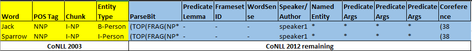

# NER_BLSTM_CNN
- Named-Entity-Recognition-with-Bidirectional-LSTM-CNNs
- Jason Chiu and Eric Nichols, Named entity recognition with bidirectional LSTM-CNNs, Transactions of the Association for Computational Linguistics, Volume 4, p.357-370, 2016. [original paper](https://aclweb.org/anthology/Q16-1026)


## Original Code
https://github.com/kamalkraj/Named-Entity-Recognition-with-Bidirectional-LSTM-CNNs

## Description
- The `NER_BLSTM_CNN` class implements named entity reognition using bi-directional LSTM's and CNN's. The paper combines three type of features as listed below.
    - Character level features like character capitalization (allUpper, lowercase, noCaps, noInfo)
    - Additional character level features by passing through generic CNN
    - Word embeddings
- The combined features are pass through a BLSTM to generate predictions for each token

- Network Model Constructed Using Keras
 

## Instructions

- Clone the repository
- Install the dependencies using `pip3 install -r requirements.txt`
- Download the word embeddings and place it inside the `embeddings` folder. The link is given inside the folder.
- Initialize a model
```python
ner = ner_blstm_cnn(num) # where num is the number of epochs
```
- Load the Data Set
```python
inputFiles = {"train": "train.txt",
              "dev": "valid.txt",
              "test": "test.txt"}

data = ner.read_dataset(train_file_names)
```
- Train the model
```python
ner.train(data)
```
- Extract the ground truth from test data for evaluation
```python
ground = ner.convert_ground_truth(data)

#By default it gives ground truth for test data. To extract for dev or train pass the type as parameter
#For dev call
#ground = ner.convert_ground_truth(data, 'dev')
```
- Generate predictions on the test data
```python
predictions = ner.predict(data)

#By default it makes predictions on test data. To make predictions on dev or train pass the type as parameter
#For dev call
#predictions = ner.predict(data, 'dev')
```
- Evaluate model
```python
P,R,F1 = ner.evaluate(predictions, ground)

print('Precision: %s, Recall: %s, F1: %s'%(P,R,F1))
```
- Running the unit tests
    - From inside the `ner_blstm_cnn` directory run `python3 -m unittest tests.runtest`
    
**Note: All scripts and functions should be called from inside the directory, otherwise relative import of parent class will fail**

## Input and Output
- Prediction
    -  Input format: Sentence (un-tokenized) - `Steve went to Paris`
    -  Output format: `[start, span, token, token, type]` - 
        - start index: int, the index of the first character of the mention span. None if not applicable.
        - span: int, the length of the mention. None if not applicable.
        - mention text: str, the actual text that was identified as a named entity. Required.
        - mention type: str, the entity/mention type. None if not applicable.<br>
`[(None, 5, Steve, B-PER),(None, went, 4, O),(None, 2, to, O), (None, 5, Paris, B-LOC)]`
- Training
    - Input format (trainig data): `DITK.NER` format as defined below
        
    - Sample data
        ```
        Yes UH (TOP(S(INTJ*) O bc/cnn/00/cnn_0003 0 0 - - - Linda_Hamilton * -
        they PRP (NP*) O bc/cnn/00/cnn_0003 0 1 - - - Linda_Hamilton * (15)
        did VBD (VP*) O bc/cnn/00/cnn_0003 0 2 do 01 - Linda_Hamilton (V*) -
        /. . *)) O bc/cnn/00/cnn_0003 0 3 - - - Linda_Hamilton * -
        ```

## Evalution
- Benchmark Datasets
    - CoNLL-2003
    - Ontonotes 5.0
    - CHEMDNER
- Evaluation metrics
    - Precision
    - Recall
    - F-1 score
- Results (Test set)

| Dataset | Precision | Recall | F-1 score | 
| :--- | :---: | :---: | :---: | 
| CoNLL-2003-en | 0.8927 | 0.9118 | 0.9021 |  
| Ontonotes 5.0 | 0.7713 | 0.8385 | 0.8035 | 
| CHEMDNER | 0.512 | 0.497 | 0.504 | 

## Demo
- [Sample notebook](./demo.ipynb)
- [Demo video](https://www.youtube.com/watch?v=ZCc42iMT6I8)
