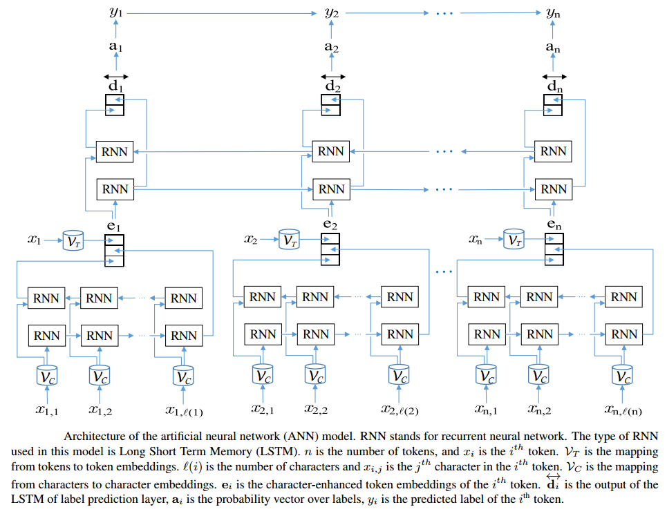

# NEURONER
- NeuroNER: an easy-to-use program for named-entity recognition based on neural networks
- Franck Dernoncourt, Ji Young Lee, and Peter Szolovits, NeuroNER: an easy-to-use program for named-entity recognition based on neural networks, Conference on Empirical Methods on Natural Language Processing (EMNLP), pages 97–102, Copenhagen, Denmark, 2017. [original paper](https://www.aclweb.org/anthology/D17-2017)

## Original Code
https://github.com/Franck-Dernoncourt/NeuroNER

## Description
- The `neuroner` class implements named entity reognition using bi-directional LSTM's. The paper generates character enhances token embeddings as follows-
    - Character embeddings are passed through BLSTM
    - The output of BLSTM is combined with word embeddings to get character enhanced token embeddings
- The character enhanced token embeddings are passed through another BLSTM to generate predictions for each token

- Network Model
 
 
## Instructions

- Clone the repository
- Install the dependencies using `pip3 install -r requirements.txt`
- Download and store glove.6B.100d.txt from [here](http://nlp.stanford.edu/data/glove.6B.zip)
- Edit the `parameters.ini` file. Give the path to the word embeddings file for `token_pretrained_embedding_filepath` variable. Also, set whether you want to train model or use a pretrained model by setting `train_model` and `use_pretrained_model` (there are default parameters for everything that can be changed)
- Initialize a model
```python
ner = neuroner(parameters_filepath="./parameters.ini")
```
- Load the Data Set
```python
inputFiles = {"train": "train.txt",
              "dev": "valid.txt",
              "test": "test.txt"}

data = ner.read_dataset(train_file_names)
```
- Train the model
```python
ner.train(data)
```
- Extract the ground truth from test data for evaluation
```python
ground = ner.convert_ground_truth(data)

#By default it gives ground truth for test data. To extract for dev or train pass the type as parameter
#For dev call
#ground = ner.convert_ground_truth(data, 'dev')
```
- Generate predictions on the test data
```python
predictions = ner.predict(data)

#By default it makes predictions on test data. To make predictions on dev or train pass the type as parameter
#For dev call
#predictions = ner.predict(data, 'dev')
```
- Evaluate model
```python
P,R,F1 = ner.evaluate(predictions, ground)

print('Precision: %s, Recall: %s, F1: %s'%(P,R,F1))
```
- Running the unit tests
    - From inside the `neuroner` directory run `python3 -m unittest tests.runtest`

**Note: All scripts and functions should be called from inside the directory, otherwise relative import of parent class will fail**

## Input and Output
- Prediction
    -  Input format: Sentence (un-tokenized) - `Steve went to Paris`
    -  Output format: `[start, span, token, token, type]` - 
        - start index: int, the index of the first character of the mention span. None if not applicable.
        - span: int, the length of the mention. None if not applicable.
        - mention text: str, the actual text that was identified as a named entity. Required.
        - mention type: str, the entity/mention type. None if not applicable.<br>
`[(None, 5, Steve, B-PER),(None, went, 4, O),(None, 2, to, O), (None, 5, Paris, B-LOC)]`
- Training
    - Input format (trainig data): `DITK.NER` format as defined below
        
    - Sample data
        ```
        Yes UH (TOP(S(INTJ*) O bc/cnn/00/cnn_0003 0 0 - - - Linda_Hamilton * -
        they PRP (NP*) O bc/cnn/00/cnn_0003 0 1 - - - Linda_Hamilton * (15)
        did VBD (VP*) O bc/cnn/00/cnn_0003 0 2 do 01 - Linda_Hamilton (V*) -
        /. . *)) O bc/cnn/00/cnn_0003 0 3 - - - Linda_Hamilton * -
        ```

## Evalution
- Benchmark Datasets
    - CoNLL-2003
    - Ontonotes 5.0
    - CHEMDNER
- Evaluation metrics
    - Precision
    - Recall
    - F-1 score
- Results (Test set)

| Dataset | Precision | Recall | F-1 score | 
| :--- | :---: | :---: | :---: | 
| CoNLL-2003-en | 0.896 | 0.911 | 0.903 |  
| Ontonotes 5.0 | 0.752 | 0.772 | 0.762 | 
| CHEMDNER | 0.552 | 0.597 | 0.573 | 

## Demo
- [Sample notebook](./demo.ipynb)
- [Demo video](https://www.youtube.com/watch?v=MO2LNQ4eP1U)
