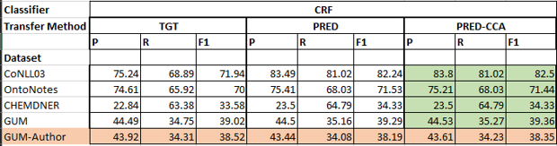
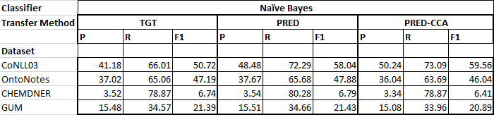
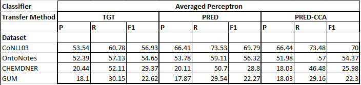

Transfer Learning for Entity Recognition of Novel Classes
=========================================================
This paper can be downloaded from http://aclweb.org/anthology/C18-1168

#### Citation: 
- Rodriguez, Caldwell and Liu, COLING, 2018.

#### Input:
 - Data in DITK.NER format as below - 
 
 
#### Output:
Returns predicted entity tags for each word in the data

#### Setup:
1. Clone the code locally
2. The execution class is located in the root directory file transferlearning_ner. 
    Import the TransferLearningforNER class from transferlearning_ner.     
3. The project needs Glove embeddings for the LSTM transfer which can be found at- 
   
   - [Glove Word Embeddings](http://nlp.stanford.edu/data/glove.6B.zip)
   
4. Read the dataset in the DITK format by passing in the files as a dictionary of train, test and dev. Also pass in the embedding file location.
    - Optionally run sample_test_lingustic.py from tests/ directory to verify setup
5. Execute the training module to generate model. Multiple algorithms, classifiers can be used for training the model. The `classifer` keyword can be one of the following `[CRF, averaged_perceptron, IIS, GIS]`. 
    The `transfer_method` can be one of the following - `[pred, predCCA, tgt, lstm]`
6. Predict data in the test file using predict, which can be evaluated using the evaluate function.

#### Overall Task:
- Framework of different algorithms to perform NER using transfer learning from a source with ample tagged data to target with limited tagged data
- Framework for coarser source domain entities to be mapped to target entities
- Different algorithms used to evaluate – 
    - PRED
    - PRED-CCA
    - Neural Networks
    
#### Benchmark Datasets used:
 1. CoNLL 2003 
 2. Ontonotes 5.0 
 3. CHEMDNER
 4. GUM
 
 #### Evaluation metrics:
 - Precision
 - Recall
 - F1

 #### Evaluation results: 
 
 
 
 
 
 
 
 
 #### Jupyter notebook demo:
 [Transfer Learning for Novel Classes Python Notebook](TransferLearningNER_demo.ipynb)
 
 #### Demo video:
 [Demo - YouTube](https://youtu.be/q7QmELIAizs)
 