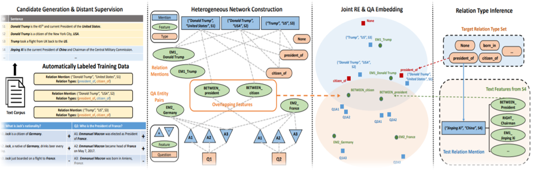

# ReQuest: Indirect Supervision for Relation Extraction Using Question-Answer Pairs

This paper can be downloaded from *[Indirect Supervision for Relation Extraction Using Question-Answer Pairs](https://arxiv.org/abs/1710.11169)*.
 
The code can be downloaded from https://github.com/ellenmellon/ReQuest


### Citation
Zeqiu Wu • Xiang Ren • Frank F. Xu • Ji Li • Jiawei Han 

Proceedings of the Eleventh ACM International Conference on Web Search and Data Mining (WSDM ‘18)


### Approach

Embedding-based framework with indirect supervision.
ReQuest uses embeddings to estimate the types of test relation mentions. 




### Input:

Put the data files in 'Benchmark_Datasets' subdirectories under `ReQuest/Benchmark_Datasets`.
This will be converted into the below common input format using the required util.py files in Data_Converter_Util as per teh dataset being used.

The common data format is as below:

`Sentence | Entity1 | E1Type | E1start | E1end | Entity2 | E2Type | E2start | E2end | Relation` 

This will then be converted into teh required json format as below by json_util.py.


<b>OR</b> download JSON directly from below provided links and out the files in 'NYT' subdirectorie under ReQuest/data/source

1.  We [process](https://github.com/shanzhenren/StructMineDataPipeline) (using our [data pipeline](https://github.com/shanzhenren/StructMineDataPipeline)) a public RE datasets to our JSON format. We ran [Stanford NER](https://nlp.stanford.edu/software/CRF-NER.shtml) on training set to detect entity mentions, and performed distant supervision using [DBpediaSpotlight](https://github.com/dbpedia-spotlight/dbpedia-spotlight) to assign type labels:
([Download JSON](https://drive.google.com/drive/folders/0B--ZKWD8ahE4UktManVsY1REOUk?usp=sharing))
 

2.  We use the [answer sentence selection dataset](https://github.com/xuchen/jacana/tree/master/tree-edit-data/answerSelectionExperiments/data) from TREC QA as our source of indirect supervision. We ran Stanford NER to extract entity mentions on both question and answer sentences and process the dataset into JSON format containing QA-pairs.
([Download JSON](https://drive.google.com/file/d/0B--ZKWD8ahE4dEZTQzI1UlRUeGc/view?usp=sharing))

### Output:

The common predicted output format is as below:

`Sentence | Entity1 | Entity2 | PredictedRelation | TrueRelation`


### Steps:

1. Put the below library under `ReQuest/code/DataProcessor/'.

* [eigen 3.2.5](http://bitbucket.org/eigen/eigen/get/3.2.5.tar.bz2) (already included).

* [stanford coreNLP 3.7.0](http://stanfordnlp.github.io/CoreNLP/) and its [python wrapper](https://github.com/stanfordnlp/stanza). 


Example:
```
$ cd code/DataProcessor/
$ git clone https://github.com/stanfordnlp/stanza
$ cd stanza
$ pip install -e .
$ wget http://nlp.stanford.edu/software/stanford-corenlp-full-2016-10-31.zip
$ unzip stanford-corenlp-full-2016-10-31.zip
```
 


2. Run ReQuest for the task of *Relation Extraction* on the NYT dataset

* Compile `request.cpp` under your own g++ environment
```
$ cd ReQuest/code/Model/request; make
```

* Start the Stanford corenlp server for the python wrapper.
```
$ java -mx4g -cp "code/DataProcessor/stanford-corenlp-full-2016-10-31/*" edu.stanford.nlp.pipeline.StanfordCoreNLPServer
```


### Feature Generation

```
$ python code/DataProcessor/feature_generation.py 
```
The hyperparamters for embedding learning are included in the run_nyt.sh script.


### Train Model
Feature extraction, embedding learning on training data, and evaluation on test data.
```
$ code/Model/request/request
```
* Note this is a cpp code which uses Eigen values for calculation. Refer to requirement.txt for execution details.


### Evaluation
Evaluates relation extraction performance (precision, recall, F1): produce predictions.
```
$ python code/Evaluation/emb_test.py
```


### Benchmark Datasets used:

* **NYT** : 1.18M sentences sampled from 294K New York Times news articles. 395 sentences are manually annotated with 24 relation types and 47 entity types. 
* **SemEval2010 - task 8** : 18 relation types, 8K training, 3K testing.


### Evaluation Metrics:

* Precison
* Recall
* F1 score


### Evaluation result:


Dataset | Precision | Recall | F1 
-------|-----------|--------|----
NYT | 0.404 | 0.480 | **0.439**
SemEval2010 | 0.412 | 0.445 | **0.428**


 
### Jupyter notebook demo:
 [Jupyter Notebook demo](ReQuest_demo.ipynb)
 
 
 
### Demo video:
 [Overview and demo](https://youtu.be/l6-W3hDm31I)
