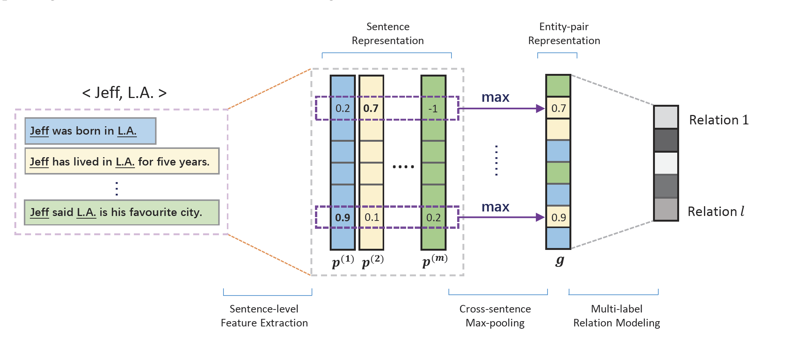
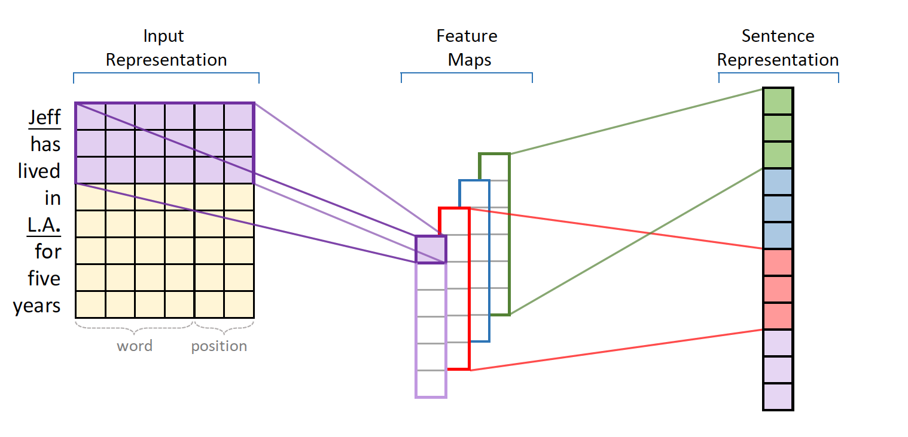
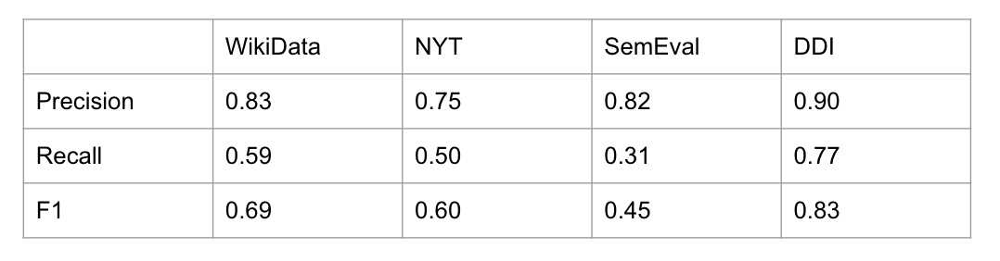
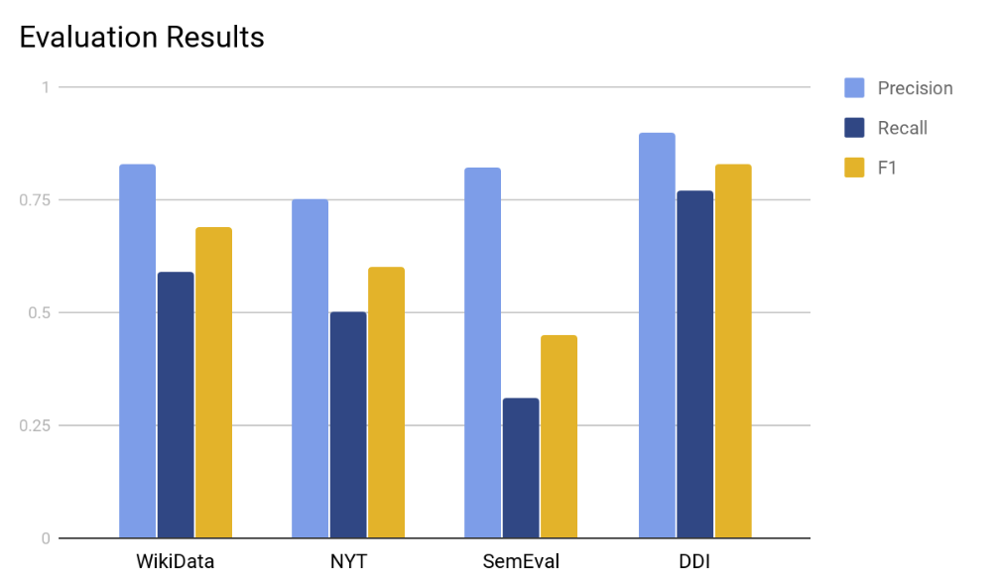

# Method Name
- Relation Extraction with Multi-instance Multi-label Convolutional Neural Networks
- Jiang, X, Wang, Q, Li, P, and Wang, B. 2016. Relation Extraction with Multi-instance Multi-label Convolutional Neural Networks. In Proceedings of COLING, 1471–1480.

## Original Code
This is the [link](https://github.com/may-/cnn-re-tf) for the original code.


## Dependencies
Besides the requirements.txt, `word2vec` directory is empty. Please download the Google News pretrained vector data from [this Google Drive link](https://drive.google.com/file/d/0B7XkCwpI5KDYNlNUTTlSS21pQmM/edit), 
and unzip it to the directory. It will be a `.bin` file.

And you need download the word2vec model [afp_apw_xin_embeddings.bin](https://drive.google.com/file/d/0B0CbnDgKi0PyZHRtVS1xWlVnekE/view?usp=sharing) and put it in the same directory

## Description

This model mainly use CNN to deal with relation extraction problem. And it is a special task since it use multi-instance and multi-label. Here's the overall architecture of MIMLCNN:

Approach:
 - Sentence-level feature extraction
     - The model first get all sentences having same eitity pairs and pad each sentence length to h with zero and transform it to a matrix representation vector, where each row represents a word token. Then it applies convolution, piecewise max-pooling on the matrix to get the vector. This vector is a vector for the entity pair. As the figure shown, we can see it use multiple sentences to generate one entity pair embedding vector.
 
- Cross sentence max-pooling
    - Use cross sentence max-polling method to get the entity-pair representation vector. This vector is a vector for the entity pair. As the figure shown, we can see the model use multiple sentences to generate one entity-pair embedding vector. This is the most important part in the paper.
- Multi-label relation modeling
    - We train a CNN classifier and calculate confidence score for each relation use the function **_o_** = **_Wg_**+**_b_**. Then we apply sigmoid to calculate the probability of each relation. The output of the original model is a vector with relation probability for an entity pair. For example, if the dataset has 5 relationships. The output will looks like:
```
[0.07 0.13 0.2 0.0 0.6]
```
## Efforts

1. The original version is written it python2 and tensorflow 1.0.1. I changed it to python3 version and tensorflow 1.0.0. It is not a easy thing we can not just use 2to3. You need to run it and solve the problem one by one.

2. I change the general input format to the required format for the model. In the original code, it use wiki data so it changes all relationships and entities to a **RID** and **QID**. It's painful task because that he has no instruction for this part and in the paper he says it use **NYT** dataset. So I dig into the code as well as all the dataset from the author. Finally I find the useage of **QID** is entity linkage. So I do the entity linkage myself and create an **ID** for each entity and then treat it as **QID**. As for relationship, I give each relation type an **ID** and treat it as **RID**.

3. I also output entity ID file and relationship ID file to make it more clear.

4. I also tried to get **QID** from wiki database using API. However it doesn't work. Also some relationships in some datasets can not be found in wiki data. So I give up the idea of getting ID from wiki database but change to generate my own one.

5. The model need a vector to represent relationships and for entities in one sentence, they may have more than one relations. However, the input is a sentence with two entities and one relations. So I calculate all the relations in the dataset and generate my own relation vectors.

6. The output of the model only have precision, recall, f1. So I have to dig into the code again and find if there is any change I can get the results from the model. I find I can only get the probablity vector but not sentence and relationship used. So I need to record the relationships and their positions so that I can know the exact relations. The tricky part is the model use embedding input for each sentence and shuffle it. So I have no corresponding text input. So I change it a little and remove the shuffle part. And then I need to read source.txt, target.txt as well as change the vector to only on relation type. It's not what we imagine that we can simply get the general results.

## Input and Output
- Input for training/prediction
```
sentence e1 e1_type e1_start_pos e1_end_pos e2 e2_type e2_start_pos e2_end_pos relation (separated by tab)
```
- output for prediction
```
sentence e1 e2 predicted_relation grandtruth_relation
```

## Evalution
- Benchmark datasets
**NYT**, **DDI**,**SemEval**,**WikiData**(private dataset)
- Evaluation metrics and results
  - metrics:precision,recall,F1
 
 

## Demo
- Juptyer notebook is in the same location as this README.MD 
- [Link](https://youtu.be/TKWHEswuEsA) to the video on Youtube
