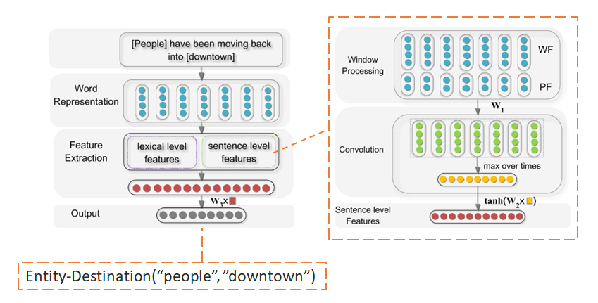
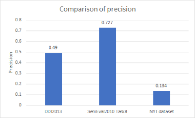
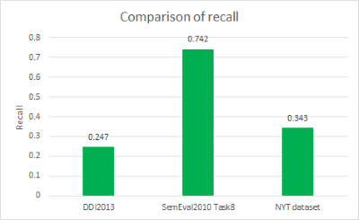
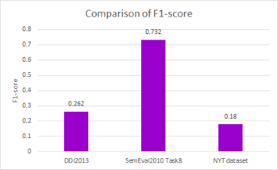

# Relation classification via convolutional deep neural network

### Refactored by Wing Wa Leung (wingwale@usc.edu)

## Title of the paper
[Relation Classification via Convolutional Deep Neural Network](https://www.aclweb.org/anthology/C14-1220)

## Full citation
    Daojian Zeng, Kang Liu, Siwei Lai, Guangyou Zhou and Jun Zhao. Relation Classification via Convolutional Deep Neural Network.  The 25th International Conference on Computational Linguistics (COLING), Dublin, Ireland, 2014.

## Original Code
[TensorFlow implementation of Relation Classification via Convolutional Deep Neural Network](https://github.com/FrankWork/conv_relation)

## Overview
* A relation extraction model that uses Convolutional Neural Network (CNN)
* Tensorflow implementation
* Input sentence is first broken down into word tokens, and each word is transformed into a word embeddings vector
* Lexical and sentence level features are extracted and concatenated to form the final feature vector
    * Sentence level features are obtained through a max-pooled CNN
* The final feature vector is fed into a softmax classifier to determine the relation type



## Input and Output
### Input
* Training and testing txt files named "relation_extraction_input_train.txt" and "relation_extraction_input_test.txt" respectively
* Format is generalized for the whole group; attributes are separated by tab
```
sentence    entity1  entity1_type entity1_start_position    entity1_end_position  entity2  entity2_type entity2_start_position    entity2_end_position  relation_type
```
* Input file is preprocessed to generate files needed for the model
    * Since the model originally uses one of the benchmarks SemEval2010 Task8, no data preprocessing is needed for this specific dataset

### Output
* Output txt file named "relation_extraction_output.txt"
* Format is generalized for the whole group; attributes are separated by tab
```
sentence    entity1  entity2  relation_type_predicted  relation_type_ground_truth
```

## Evalution
### Benchmark datasets
1. DDI2013
    * 5 relation types
    * Training set: 27792 samples
    * Testing set: 5716 samples

2. SemEval2010 Task8
    * 19 relation types
    * Training set: 8000 samples
    * Testing set: 2717 samples

3. NYT dataset
    * 25 relation types
    * Training set: 235275 samples
    * Testing set: 388 samples

### Evaluation metrics
* Precision*
* Recall*
* F1-score*

(*: marco-averaged)

### Evaluation results
* Precision



* Recall



* F1-score



## Links to Jupyter notebooks
* [Benchmark 1: training](cnn_notebook1_train.ipynb)
* [Benchmark 1: evaluation](cnn_notebook1_test.ipynb)

* [Benchmark 2: training](cnn_notebook2_train.ipynb)
* [Benchmark 2: evaluation](cnn_notebook2_test.ipynb)

* [Benchmark 3: training](cnn_notebook3_train.ipynb)
* [Benchmark 3: evaluation](cnn_notebook3_test.ipynb)

## [Link to Youtube video](https://youtu.be/4IUzWw3d6To)

## Remarks
* The test cases are written by myself because our group does not have a common one