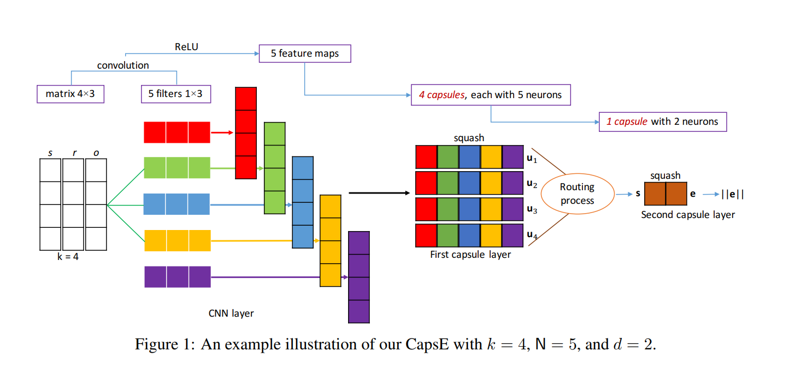

# CapsE
Nguyen, Dai Quoc, et al. "A Capsule Network-based Embedding Model for Knowledge Graph Completion and Search Personalization." arXiv preprint arXiv:1808.04122(2018).

## Original Code
https://github.com/daiquocnguyen/CapsE

## Description
- The high level goal is to learn a vector representation i.e. embeddings of entities and relations to predict missing links in a knowledge graph.
Embeddings are used to construct scores for triples, which are used to determine the probability that new links should be created. The embedding dimensionality
is a hyperparameter that is tuned through validation. This particular model uses a convolutional neural network with what the authors refer to as "capsules"
to capture relationships between entities. This method differs from many others in that it captures a more complex decision boundary via nonlinear transformations.

## Input and Output
### Input
- Knowledge graph: (triples i.e “s r o” or “h r t”)
### Output
- Newly predicted triples

## Evalution
### FN15k
- `MRR: 0.415159972`
- `hits1: 0.336949585`
- `hits10: 0.559827696`
### WN18
- `MRR: 0.57218076`
- `hits1: 0.55484706`
- `hits10: 0.60163197`

## Demo
- [Jupyter notebook](capse_notebook.ipynb)
- [YouTube video](https://youtu.be/-fu7EeobUIY)
