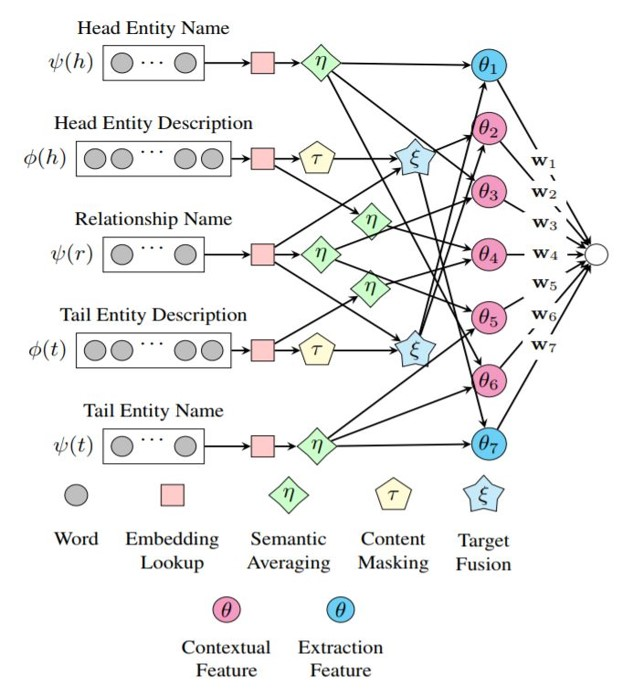

# Open-World Knowledge Graph Completion

## Citation:

* Baoxu Shi, Tim Weninger Open-World Knowledge Graph Completion. AAAI Conference on Artificial Intelligence, (AAAI-18), the 30th innovative Applications of Artificial Intelligence (IAAI-18), and the 8th AAAI Symposium on Educational Advances in Artificial Intelligence (EAAI-18), New Orleans, Louisiana, USA, February 2-7, 2018. AAAI Press 2018 [pdf](https://arxiv.org/pdf/1711.03438v1.pdf)

* https://github.com/bxshi/ConMask

## Prerequisite
- Python 3
- Tensorflow 1.3

## Download datasets
- DBPedia50k dataset https://drive.google.com/file/d/1qw8d0LGT18D_3p2_dNmyqztkgZO4ageW/view?usp=sharing
- DBPedia500k dataset https://drive.google.com/file/d/1Tx1gyMoj-9RkbdRvKzHYZ5EZmSrUywVF/view?usp=sharing

## Input/Output format for prediction

**Input:**
- [entity1, entity2, relation] triples

**Output:**
- [entity1, predicted_entity2, relation] triples
- *Note:* ConMask only predicts entities

## For Training
- Place the downloaded dataset under ```/data```

## Approach
- ConMask-An Open World KG Completion model learns embeddings of the entity’s name and parts of its text-description to connect unseen entities to the KG.
- ConMask uses primarily text features to learn entity and relationship embeddings.
- ConMask consists of three components:
1. Relationship-dependent content masking, which highlights words that are relevant to the task
2. Target fusion, which extracts a target entity embedding from the relevant text, and
3. Target entity resolution, which chooses a target entity by computing a similarity score between target entity candidates in the KG, the extracted entity embeddings, and
other textual features.
- ConMask selects words that are related to the given relationship to mitigate the inclusion of irrelevant and noisy words. From the relevant text, ConMask then uses fully convolutional network (FCN) to extract word-based embeddings. Finally, it compares the extracted embeddings to existing entities in the KG to resolve a ranked list of target entities.


## Benchmark datasets

- FB15k
- FB20k
- DBPedia50k
- DBPedia500k

## Evaluation metrics and results
Following is the evaluation for DBPedia50k for predicting head and tail done by refactored code:
|            |        For Head          |         For Tail          |
|            | MRR   | HITS@10 |   MR   |  MRR   | HITS@10 |   MR   |
| :--------: | :---: | :-----: | :----: |  :---: | :-----: | :----: |
| DBPedia50k | 0.34  |   0.32  |   89   |  0.57  |   0.75  |   20   |

## To run model
- A jupyter notebook could not be implemented for this project due to the different required arguments as parameters.
- Following is the step to run the model saved [here](https://drive.google.com/file/d/1OsSwP2LTHiPzP_gManIrjdAxUjj9nl8t/view?usp=sharing)
```
python3 -m ndkgc.models.fcn_model_v2 checkpoint_db50_v2_dr_uniweight_2 data/dbpedia50 --force_eval --layer 3 --conv 2 --lr 1e-2 --keep_prob 0.5 --max_content 512 --pos 1 --neg 4 --open --neval 5000 --eval --filter
```

## YouTube Video
