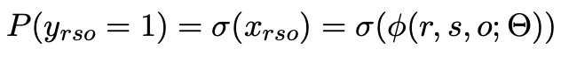

# SimplE
Kazemi, Seyed Mehran, and David Poole. "SimplE embedding for link prediction in knowledge graphs." Advances in Neural Information Processing Systems. 2018.
## Original Code
https://github.com/Mehran-k/SimplE (I converted this repository from Python2 to Python3)

## Description
- The high level goal is to learn a vector representation i.e. embeddings of entities and relations to predict missing links in a knowledge graph.
Embeddings are used to construct scores for triples, which are used to determine the probability that new links should be created. The embedding dimensionality
is a hyperparameter that is tuned through validation. This particular model uses the Hadamard product of the learned embeddings as a scoring function, which is then fed into a sigmoid to interpret as a probability.

## Input and Output
### Input
- Knowledge graph: (triples i.e “s r o” or “h r t”)
### Output
- Newly predicted triples

## Evalution
### FN15k
- `MRR: 0.7223`
- `hits1: 0.6545`
- `hits10: 0.8365`
### WN18
- `MRR: 0.9397`
- `hits1: 0.9347`
- `hits10: 0.9462`

## Demo
- [Jupyter notebook](simple_notebook.ipynb)
- [YouTube video](https://youtu.be/DC7akW77Ueo)
