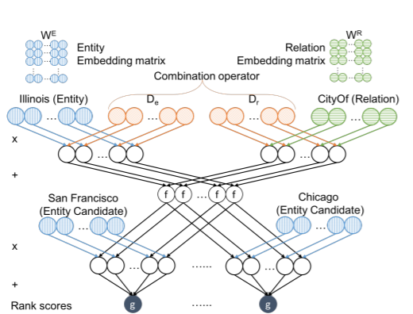

# ProjE: Embedding Projection for Knowledge Graph Completion

- The paper can be dowloaded from https://arxiv.org/pdf/1611.05425.pdf
- Citation: Baoxu Shi, Tim Weninger, Proceedings of the Thirty-First AAAI Conference on Artificial Intelligence, February 4-9, 2017

## Original Code
Github URL of the original code: https://github.com/bxshi/ProjE

## Description
- The paper presents the Knowledge Graph Completion problem as a ranking task and optimizes the collective scores of the list of candidate entities. Because we want to optimize the ordering of candidate entities collectively, we need to
project the candidate entities onto the same embedding vector. For this task we learn a combination operator
that creates a target vector from the input data. Then, the candidate entities are each projected onto the same
target vector.
- The output is an embedding vector for evry entity and relation in the knowledge graph.
- The image below shows the architecture and an example of an entity prediction task using the embeddings generated.

## Setup
(Tested on Python 3, Linux based systems.)
- Clone the git repository
- Install the requirements
	- pip install -r requirements.txt

## Input and Output
- Training
	- Input is knowledge graph
	- Output is embedding vectors stored in a .txt file with the format: <Entity - id> [vector]

## Evaluation
- #### Benchmark Datasets
    - FreeBase (FB15k)
    - YAGO
- #### Evaluation Metrics
    - Mean rank (MR)
    - HITS@10
- #### Evaluation Results

| Type of entity prediction | Dataset | Mean rank (raw) | Mean rank (filtered) | HITS@10(%) (raw) | HITS@10(%) (filtered)|
|---------------------------|---------|-----------------|----------------------|------------------|----------------------|
| Head prediction | FB15k | 535.6 | 475.9 | 31.8 | 37.4 |
| Tail prediction | FB15k | 398.6 | 360.4 | 39.4 | 45.0 |
| Head prediction | YAGO | 1428.3 | 1406.7 | 18.5 | 27.4 |
| Tail prediction | YAGO | 201.4 | 198.1 | 33.4 | 38.1 |

The filtered mean rank and filtered HITS@k ignore all other true entities/relationships in the result and only look at the target entity/relationship.

## Demo
- Link to the Jupyter Notebook 
- Link to the video on Youtube
