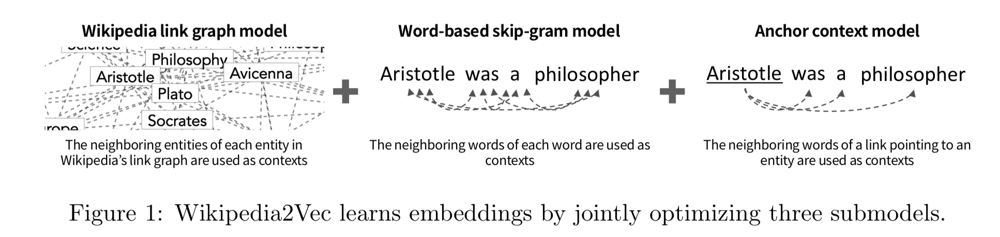
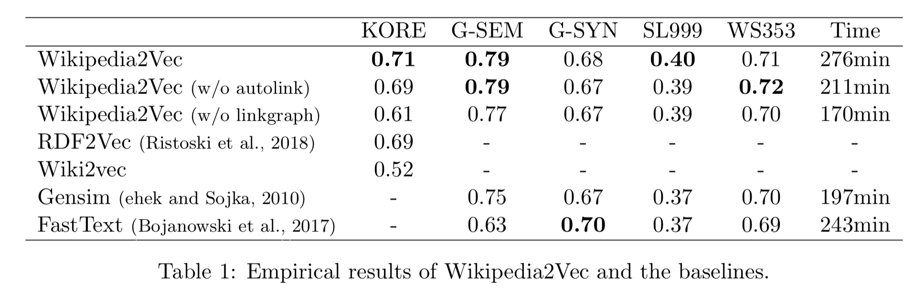

# Wikipedia2Vec
A tool for learning vector representations of words and entities from Wikipedia.
* **Title of the paper:** Wikipedia2Vec: An Optimized Tool for Learning Embeddings of Words and Entities from Wikipedia
* **Full Citation:** Ikuya Yamada, Hiroyuki Shindo, Hideaki Takeda, Yoshiyasu Takefuji. Proceedings of The 20th SIGNLL Conference on Computational Natural Language Learning, Berlin, Germany, 2016. 

## Original Code
https://github.com/wikipedia2vec/wikipedia2vec

## Description
Wikipedia2Vec is a tool used for obtaining embeddings (or vector representations) of words and entities (i.e., concepts that have corresponding pages in Wikipedia) from Wikipedia.This tool enables you to learn embeddings of words and entities simultaneously, and places similar words and entities close to one another in a continuous vector space. Embeddings can be easily trained by a single command with a publicly available Wikipedia dump as input. This tool has been used in several state-of-the-art NLP models such as entity linking, named entity recognition, knowledge graph completion, entity relatedness, and question answering.

This tool learns embeddings of words and entities by iterating over entire Wikipedia pages and jointly optimizing the following three submodels (see Figure 1):
* **Wikipedia link graph model**, which learns entity embeddings by predicting neighboring entities in Wikipedia’s link graph, an undirected graph whose nodes are entities and edges represent links between entities, based on each entity in Wikipedia. Here, an edge is created between a pair of entities if the page of one entity has a link to that of the other entity or if both pages link to each other.
* **Word-based skip-gram model**, which learns word embeddings by predicting neighboring words given each word in a text contained on a Wikipedia page.
* **Anchor context model**, which aims to place similar words and entities near one another in the vector space, and to create interactions between embeddings of words and those of entities. Here, we obtain referent entities and their neighboring words from links contained in a Wikipedia page, and the model learns embeddings by predicting neighboring words given each entity.
These three submodels are based on the skip-gram model (Mikolov et al., 2013a,b), which is a neural network model with a training objective to find embeddings that are useful for predicting context items (i.e., neighboring words or entities) given a target item.



## Input and Output
* Input: Wikipedia dump database and a dictionary of words and entities
* Output: Embeddings for entities

## Approach
The child class file, "wikipedia2vec_sm.py" and the "main.py" file are located in the "modules" folder. This organisation is required for successfull execution of the code.

**1. Download Wikipedia2vec dump** 
```bash
wget https://dumps.wikimedia.org/enwiki/latest/enwiki-latest-pages-articles.xml.bz2
```

**2. Instantiate the child class** 
An object is created for the Wikipedia2vec Child class
```bash
obj = Wikipedia2vec()
```

**3. Read the dataset** <br/>
Reads a dataset in preparation to learn embeddings. Returns data in proper format to learn embeddings. Saves the required file names in chosen_dataset.txt to be used by other methods of the program
```bash
obj.read_dataset(filename)
```
**4. Build Dump Database** <br/>
The build_dump command creates a database that contains Wikipedia pages each of which consists of texts and anchor links in it.
```bash
dump_file = 'enwiki-latest-pages-articles.xml.bz2'
build_dump(dump_file, 'output.db')
```
**5. Build Dictionary** <br/>
The build_dictionary command builds a dictionary of words and entities.
```bash
obj.build_dictionary('output.db', 'output_dic')
```
**6. Build Mention DB** <br/>
The build_mention_db command builds a database that contains the mappings of entity names (mentions) and their possible referent entities.
```bash
obj.build_mention_db('output.db', 'output_dic', 'output_md')
```
**7. Build Link Graph** <br/>
The build_link_graph command generates a sparse matrix representing the link structure between Wikipedia entities.
```bash
obj.build_link_graph('output.db', 'output_dic', 'output_lg')
```
**8. Learn Embeddings** <br/>
The learn_embeddings command runs the training of the embeddings.
```bash
obj.learn_embeddings('output.db', 'output_dic', 'final_output', link_graph_file='output_lg', mention_db_file='output_md')
```
**9. Save Model** <br/>
The save_model command outputs the model in a text format.
```bash
obj.save_model('final_output', 'final_output_text')
```
**10. Load Model** <br/> 
The load_model command loads a pretrained model to learn the embeddings.
```bash
obj.load_model('final_output_text')
```
**11. Evaluation** <br/>
Evaluation metric used is Spearman's coefficient using cosine similarity.
```bash
obj.evaluate('final_output_text')
```
## Benchmark Datasets and Evaluation
* **Freebase**
  * 14904 entities, 1341 relations
  * triple format <e1, e2, rel>

* **Wikidata**
  * 12554 entities, 24 relations
  * triple format <e1, rel, e2> along with timestamp
  
* **Yago**
  * 10623 entities, 10 relations
  * triple format <e1, rel, e2> along with 
   timestamp

**Evaluation Metric** : Spearman’s rank correlation coefficient between human judgment scores and cosine similarity between embeddings

|               | KORE     | GSEM     | GSYN    | SL999    | WS353    | Freebase | Wikidata | Yago     |
| ------------- |:--------:| --------:|--------:| --------:| --------:| --------:| --------:| --------:|
| Wikipedia2Vec |0.71      | 0.79     | 0.68    | 0.4      | 0.71     | 0.65     | 0.72     | 0.62     |
             



## Demo

* Jupyter Notebook: https://github.com/samikshm/ditk/blob/develop-py2/graph/embedding/wikipedia2vec_sm/modules/wikipedia2vec.ipynb
* Youtube video: https://studio.youtube.com/video/4bemSmVCwtM/edit
