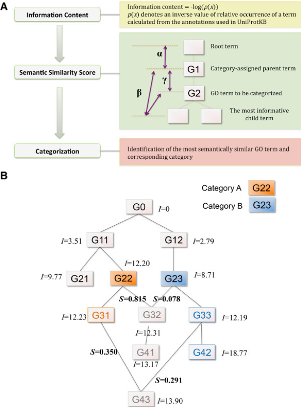

# Categorizer: a tool to categorize genes into user-defined biological groups based on semantic similarity

Na, Dokyun, Hyungbin Son, and Jörg Gsponer. "Categorizer: a tool to categorize genes into user-defined biological groups based on semantic similarity." BMC genomics 15.1 (2014): 1091.

## Input/Output format 
Input a list of genes and a user defined categories, and return each gene enrich in which caregory.

input gene list 

~~~
SelD
TH1
CG14438
Nup154
zip
CG42818
skd
Pfk
ssp
Got1
~~~
input categories defination 

~~~
#------------------------------
-Cell cycle
#------------------------------
        GO:0007049 # cell cycle

#------------------------------
-Cytoskeleton
#------------------------------
        GO:0007010 # cytoskeleton organization

#------------------------------
-Metabolism
#------------------------------
        GO:0008152 # metabolic process

#------------------------------
-Protein synthesis
#------------------------------
        GO:0010467 # gene expression
~~~

output

~~~
Cell cycle	30	shot,Chro,14-3-3epsilon,Bub3,mor,ssp,14-3-3zeta,Pten,crol,Dp,Dhc64C,pum,Cka,Tango6,smt3,brm,polo,BubR1,zip,lwr,Spt5,Sin3A,nej,p53,pzg,Klp61F,Aos1,Ald,skpA,alph
Cytoskeleton	32	shot,Hel25E,Chro,lilli,Hsp83,Bub3,arm,Slu7,lkb1,Galphai,Rpn1,Pten,hts,Dhc64C,Pi3K68D,smt3,Atx2,vib,polo,BubR1,LamC,zip,T-cp1,Spt5,chic,Rab11,Tektin-C,Khc-73,Klp61F,pnut,CalpA,skpA
Metabolism	116	ttk,Prosalpha5,ocm,SelD,lilli,TH1,skd,Sec23,th,IntS2,IntS1,IntS4,mor,IntS9,IntS8,ssp,arm,Akt1,Hmgcr,faf,Pdsw,14-3-3zeta,Spp,Cpsf100,eff,lkb1,Tao,Sec61alpha,Cpsf73,en,Galphai,Nipped-A,Rpn1,nonC,Asph,Gpdh,Pten,crol,Uba1,Rab5,Rheb,Smg5,gol,IntS11,Dp,Dhc64C,Pi3K68D,e(y)1,ATPsyn-b,rn,Trip1,pum,Rpn3,Nelf-E,omd,smt3,Prosbeta1,RhoGAP92B,Chrac-14,ZC3H3,Rpt5,Prp19,Rpt1,Tor,CHIP,sol,brm,polo,CkIIalpha,BubR1,hay,lwr,Pfk,Sir2,Eip75B,Spt5,Sin3A,nej,Mlf,Rpd3,p53,Nelf-A,Src42A,Uba2,Got1,Nnp-1,Pi3K92E,Mcm6,PyK,Upf1,Arf102F,Upf2,Taf4,lic,hiw,Rpn10,Mmp2,bin3,CkIIbeta,betaTub56D,Aos1,Mef2,Hsf,Rtc1,pnut,defl,CalpA,NELF-B,Jra,Ald,eIF3-S9,Pgk,Pgi,Hsromega,skpA,alph
Protein folding	10	Hsp83,14-3-3zeta,Hsc70-5,Hsc70-4,Hsc70Cb,DnaJ-1,T-cp1,Tpr2,Hop,mrj
~~~

Other input including 

* gene ontology file [see here](http://geneontology.org/docs/ontology-documentation/)

* gene annotation file [see here](http://geneontology.org/docs/go-annotations/)

## Overall task, the method and model

* Classifies genes into user-defined groups (categories) 
* Calculates p-values for the enrichment of the categories
* Enrichment analysis, z-score calculated via simulation

Communalities between large sets of genes obtained from high-throughput experiments are often identified by searching for enrichments of genes with the same Gene Ontology (GO) annotations. The GO analysis tools used for these enrichment analyses assume that GO terms are independent and the semantic distances between all parent–child terms are identical, which is not true in a biological sense. In addition these tools output lists of often redundant or too specific GO terms, which are difficult to interpret in the context of the biological question investigated by the user. Therefore, there is a demand for a robust and reliable method for gene categorization and enrichment analysis.

Categorizer, a tool that classifies genes into user-defined groups (categories) and calculates p-values for the enrichment of the categories. Categorizer identifies the biologically best-fit category for each gene by taking advantage of a specialized semantic similarity measure for GO terms. 

## Benchmark datasets and Evaluation
There is no ground truth for an enrichment analysis. But in the paper they used manually categorized Drosophila genes of Huntington’s disease as a gold standard.

* [Jupyter notebook ](./demo.ipynb)
* [Youtube videos](https://youtu.be/BDbLFK3yiMk)

