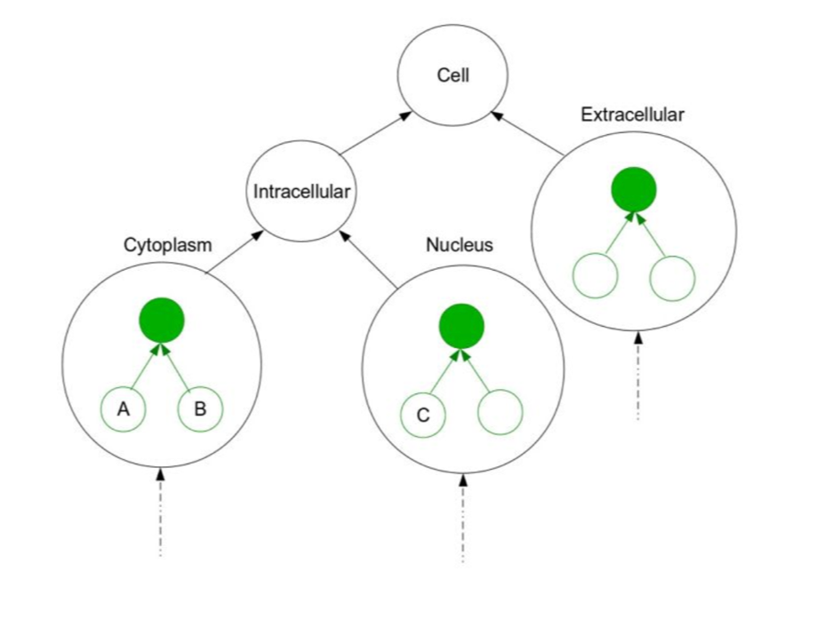

# An improved method for scoring protein-protein interactions using semantic similarity within the gene ontology

Jain, Shobhit, and Gary D. Bader. "An improved method for scoring protein-protein interactions using semantic similarity within the gene ontology." BMC bioinformatics 11.1 (2010): 562.

## Input/Output format 
Input a list of gene pairs, and return similarity score between those pairs of gene (as well as gene ontolgy type using for calculate it).

input

~~~
S000005303,S000003102
S000001738,S000005800
S000006013,S000004413
S000001650,S000004668
S000004278,S000000183
S000005522,S000006215
S000005658,S000006778
S000005425,S000004362
S000005760,S000004431
S000004051,S000029708
~~~

output

~~~
S000001774,S000003333,Cellular Component: 0.333031456457
S000000313,S000000825,Cellular Component: 0.0494074443379
S000005394,S000004723,Cellular Component: 0.458155343793
S000003592,S000001019,Cellular Component: 0.120514463903
S000000327,S000003478,Cellular Component: 0.544101059604
~~~

Other input including 

* gene ontology file [see here](http://geneontology.org/docs/ontology-documentation/)

* gene annotation file [see here](http://geneontology.org/docs/go-annotations/)

## Overall task, the method and model

* find subsets of GO terms defining similar concepts
* score gene products belonging to a similar subset higher than if they belong to different sets

Semantic similarity measures are useful to assess the physiological relevance of protein-protein interactions (PPIs). They quantify similarity between proteins based on their function using annotation systems like the Gene Ontology (GO). Proteins that interact in the cell are likely to be in similar locations or involved in similar biological processes compared to proteins that do not interact. Thus the more semantically similar the gene function annotations are among the interacting proteins, more likely the interaction is physiologically relevant. However, most semantic similarity measures used for PPI confidence assessment do not consider the unequal depth of term hierarchies in different classes of cellular location, molecular function, and biological process ontologies of GO and thus may over- or under-estimate similarity.

We describe an improved algorithm, Topological Clustering Semantic Similarity (TCSS), to compute semantic similarity between GO terms annotated to proteins in interaction datasets. Our algorithm, considers unequal depth of biological knowledge representation in different branches of the GO graph. The central idea is to divide the GO graph into sub-graphs and score PPIs higher if participating proteins belong to the same sub-graph as compared to if they belong to different sub-graphs.

## Benchmark datasets and Evaluation

Evaluated by using yeast PPI dataset.

* [Jupyter notebook ](./demo.ipynb)
* [Youtube videos](https://youtu.be/xsasAPskHLc)

