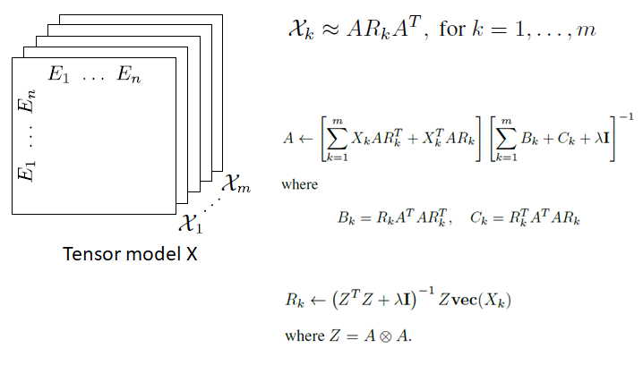
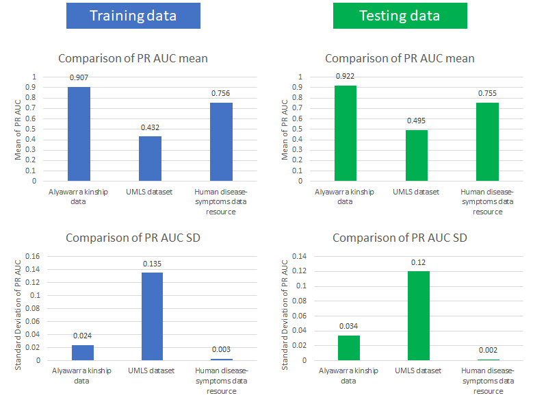

# RESCAL

### Refactored by Wing Wa Leung (wingwale@usc.edu)

## Title of the paper
A Three-Way Model for Collective Learning on Multi-Relational Data

## Full citation
Maximilian Nickel, Volker Tresp and Hans-Peter-Kriegel. A Three-Way Model for Collective Learning on Multi-Relational Data. Proceedings of the 28th International Conference on Machine Learning, Bellevue, USA, 2011.

## Overview
* Rescal factorizes each slice of tensor X into 2 matrices A and Rk using Alternating Least Square (ALS) approach

* Matrix A contains the latent component representation of the entities in the domain
* Matrix Rk models the interactions of the latent components in the k-th predicate

## Input/Output format for the model
### Inputs
* Tensor model X (n * n * m)
* Rank r

### Outputs
For each frontal slice of the tensor X (Xk):
* Matrix A (n * r)
* Matrix Rk (r * r)

## Benchmark datasets
1. Alyawarra kinship data
    * Collected by Denham
    * 104 entities
    * 26 relations

2. UMLS dataset from a biomedical ontology
    * Prepared by McCray et al.
    * 135 entities
    * 49 relations
    
3. Human disease-symptoms data resource 
    * Prepared by Zitnik et al.
    * 1578 entities
    * 3 relations

## Evaluation metrics and results
### Evaluation metrics
For both training and testing data:
* Mean of Precision Recall Area Under Curve (PR AUC)
* Standard deviation of PR AUC

### Evaluation results

## [Link to Jupyter notebook](rescal_notebook.ipynb)

## [Link to Youtube video]()