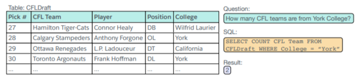
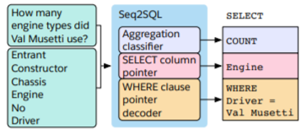

# SQLNet
This repo provides an implementation of SQLNet for predicting SQL queries on [WikiSQL dataset](https://github.com/salesforce/WikiSQL). The paper is available at [here](https://arxiv.org/abs/1711.04436).
This project uses test.py for unit testswas written by me, it tests basic file loading, db loading, and output types
The input file and output file are identical because the json file includes ground truth and orginal query. 
This avoids tedious indexing and record matching
Upon successful operation, the ground truth json will be regenerated using results from the model. The ground truth and output files are called
db.csv and entry.csv respectively

### Title of the paper
SQLNet: Generating Structured Queries from Natural Language Without Reinforcement Learning

### Full citation
> Xiaojun Xu, Chang Liu, Dawn Song. 2017. SQLNet: Generating Structured Queries from Natural Language Without Reinforcement Learning.[Github Link](https://github.com/xiaojunxu/SQLNet)

### Input/Output format for prediction
Input:<br/>
-Tokenized natural language in JSON<br/>
-Evaluation Database Name<br/>
-Table ID<br/>
Output:<br/>
-Tokenized SQL Query in JSON<br/>

### Input/Output format for training
Input:<br/>
-Tokenized natural language in JSON<br/>
-Training Database Name<br/>
-Table ID<br/>
Output:<br/>
-Tokenized SQL Query in JSON<br/>

### A paragraph describing the overall task, the method and model
The method performs classification on Aggregation, Selection, and Conditional clauses for SQL query. 
It leverages pointer networks to be able to extend length of prediction. The model then performs 
classification on generated results from the pointer network using a multi-layer perceptron. For conditional clause,
the model also uses reinforcement learning to get the best out of associative nature of the where clause. It evaluates
accuracy using mean error on aggregation, selection, and conditional clause. It also reports a global mean error
for checking if all three sections are correct.

### A figure describing the model
<p align="center"></p>
<p align="center"></p>
<p align="center"></p>

### Benchmark datasets
1. [WikiSQL Dataset](https://github.com/salesforce/WikiSQL)

### Evaluation metrics and results
| Accuracy Type        | Acc_agg           | Acc_sel  | Acc_where|Acc_agg|Acc_sel|Acc_where
| ------------- |:-------------:| -----:|-----:|-----:|-----:|-----:|
| SQLNet(Seq2set+CA) Evaluation @50Epoch      | 90.1%| 90.4% | 68.6% |90.0%|89.8%|67.0%|
| Seq2SQL      | 90.0%      |   89.6% |62.1%|90.1%|88.9%|60.2%|
| Seq2SQL(Column-order) | -      |    - |63.3%|-|-|61.2%|
| SQLNet(Seq2set) | -      |    - |69.1%|-|-|67.1%|
| SQLNet(Seq2set+CA) | 90.1%      |    91.1% |72.1%|90.3%|90.4%|70.0%|
| SQLNet(Seq2set+CA+WE) | 90.1%    |    91.5% |74.1%|90.3%|90.9%|71.9%|

### Jupyter Notebook
I wasn't able to successfully run Jupyter notebook from Google Cloud and included the description and running the
code in the video

### Youtube Link:
https://youtu.be/M30df2NH08Q


## Installation
The data is in `data.tar.bz2`. download the data and Unzip the code by running
```bash
bash download_data.sh
```

The code is written using PyTorch in Python 2.7. Check [here](http://pytorch.org/) to install PyTorch. You can install other dependency by running 
```bash
pip2 install -r requirements.txt
```

## Downloading the glove embedding.
Download the pretrained glove embedding from [here](https://github.com/stanfordnlp/GloVe) using
```bash
bash download_glove.sh
```
## Extract the glove embedding for training.
Run the following command to process the pretrained glove embedding for training the word embedding:
```bash
python2 main.py --extract_emb
```

## Train
The training script is `train.py`. To see the detailed parameters for running:
```bash
python2 main.py --train -h
```

Some typical usage are listed as below:

Train a SQLNet model with column attention:
```bash
python2 main.py --train --ca
```

Train a SQLNet model with column attention and trainable embedding (requires pretraining without training embedding, i.e., executing the command above):
```bash
python2 main.py --train --ca --train_emb
```

Pretrain a [Seq2SQL model](https://arxiv.org/abs/1709.00103) on the re-splitted dataset
```bash
python2 main.py --train --baseline --dataset 1
```

Train a Seq2SQL model with Reinforcement Learning after pretraining
```bash
python2 main.py --train --baseline --dataset 1 --rl
```

## Test
The script for evaluation on the dev split and test split. The parameters for evaluation is roughly the same as the one used for training. For example, the commands for evaluating the models from above commands are:

Test a trained SQLNet model with column attention
```bash
python2 main.py --test --ca
```

Test a trained SQLNet model with column attention and trainable embedding:
```bash
python2 main.py --test --ca --train_emb
```

Test a trained [Seq2SQL model](https://arxiv.org/abs/1709.00103) withour RL on the re-splitted dataset
```bash
python2 main.py --test --baseline --dataset 1
```

Test a trained Seq2SQL model with Reinforcement learning
```bash
python2 main.py --test --baseline --dataset 1 --rl
```

## Inference mode
To run the script for evaluating and pretty printing output
```bash
python2 main.py --evaluate --ca
```

Inference mode with a trained SQLNet model with column attention and trainable embedding:
```bash
python2 main.py --evaluate --ca --train_emb
```

Inference mode with a trained [Seq2SQL model](https://arxiv.org/abs/1709.00103) withour RL on the re-splitted dataset
```bash
python2 main.py --evaluate --baseline --dataset 1
```

Inference mode with a trained Seq2SQL model with Reinforcement learning
```bash
python2 main.py --evaluate --baseline --dataset 1 --rl
```
