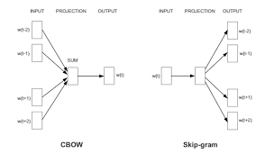

# Word2Vec
This project contains an implementation of the Word2Vec algorithm to perform Word Embedding.

[**EFFICIENT ESTIMATION OF WORD REPRESENTATIONS IN VECTOR SPACE**](https://arxiv.org/pdf/1301.3781.pdf), Tomas Mikolov, Kai Chen, Greg Corrado, Jeffrey Dean, published at , International Conference on Learning Representations – 2013. I furthermore provide all datasets used (including the preprocessing scripts), and Python scripts for experiments.

 

#### Original Code

https://github.com/RaRe-Technologies/gensim
#### Input and Output

>>Input:
- Word(s) 
- Sentence(s) 
- Paragraph(s)
- Trained Word2Vec model : If you want to give a pretrained model on which predictions have to be made.

>>Output:
The model outputs :
-	Embedding / Average Embeddings
-	Similarity between words/sentences/ documents


#### Description

>Task: 
- Embeddings(Representation) of Word(s), Sentence(s), Document(s)


>Approach:
-	Represent each word with a low-dimensional vector
-	Word similarity = vector similarity
-	Key idea: Predict surrounding words of every word
-	Faster and can easily incorporate a new sentence/document or add a word to the vocabulary
-	2 basic neural network models:
•	Continuous Bag of Word (CBOW): use a window of word to predict the middle word
•	Skip-gram (SG): use a word to predict the surrounding ones in window 


#### Implementation
-	Load the text corpus and preprocess the text
-	Train the word2vec model with the embedding dimension(default – 200) using the text corpus and model(Skip-gram or CBOW)
-	Load the trained model from the pickle dump
-	Evaluate the model by computing similarities, detecting analogies, performing sentimental analysis


#### Evaluation

The benchmark datasets used for this project were:

1. SICK 2014 (SemEval 2014, Task 1)
 - http://alt.qcri.org/semeval2014/task1/
2. SemEval 2014 Task 10
 - http://alt.qcri.org/semeval2014/task10/
3. SemEval 2017 Task 1
 - http://alt.qcri.org/semeval2017/task1/

>EVALUATION METRICS : 
- Pearson Correlation Coefficient
- Spearman Correlation Coefficient
- Mean Squared Error


>Results:
 

## To Run 

>> Install the following packages : 
```sh
pip install numpy
pip install scipy
pip install gensim
```

1) Download the module code repository -- ditk/text/embedding/word2vec
2) Ensure that the main.py, word2vec.py, datasets are in the same folder, if not give the absolute paths accordingly.
3) Run main.py


