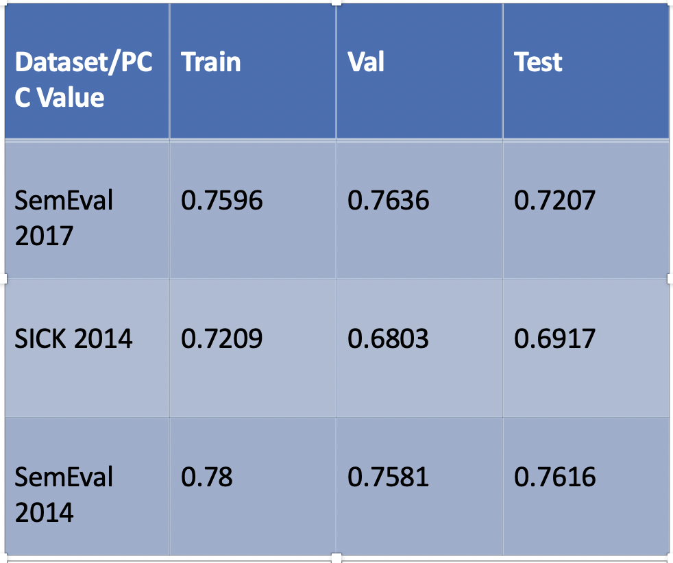

# Semantic Textual Similarity using CNNs

- Title of the paper : HCTI at SemEval-2017 Task 1: Use convolutional neural network to evaluate Semantic Textual Similarity
- Full citation : Yang Shao, “HCTI at SemEval-2017 Task 1: Use convolutional neural network to evaluate Semantic Textual Similarity,” Proceedings of the 11th International Workshop on Semantic Evaluation (SemEval 2017), Association for Computational Linguistics, Vancouver, Canada 
https://www.aclweb.org/anthology/S17-2016

## Original Code
https://github.com/celarex/STS-CNN-STSbenchmark-Semantic-Similarity-Semantic-Textual-Similarity-CNN-HCTI-Tensorflow-Keras

## Description
Approach:
-Use a convolutional neural network to transfer hand-crafted feature 
 enhanced GloVe word vectors. 
-Calculate a semantic vector representation of each sentence by max pooling
 every dimension of their transformed word vectors.
-Concatenate element-wise absolute difference and element-wise 
multiplication of their semantic vectors .
-Use a fully- connected neural network to transfer the semantic difference vector
 to a probability distribution over similarity scores. 

## Input and Output

### Input:
List of sentence pairs – .txt file or .csv file
Train - ( Sentence1, Sentence2, Similarity score)
Test – (Sentence1, Sentence2)
 
### Output:
Train - model
Test – Similarity scores (float between 0.0-1.0)

## Evalution

### Evaluation Datasets

#### SemEval 2017 –Task1
5215 Sentence pairs with similarity scores.
STS 2017 will assess the ability of systems to determine the degree of semantic similarity between monolingual and cross-lingual sentences in Arabic, English and Spanish.

#### SICK 2014
The SICK data set consists of about 10,000 English sentence pairs, generated starting from two existing sets: the 8K ImageFlickr data set and the SemEval 2012 STS MSR-Video Description data set. 

#### SemEval 2014 –Task 10
A combination of 1785 sentence pairs with similarity scores from various sources like headlines, tweets and deft news.

### Evaluation Metric

Pearson Correlation Co-efficient (0-1)

### Results

## Demo
- Link to the Jupyter Notebook  - The code uses Tensorflow and Keras. Since, the loading of the GloVe vectors is required to predict the scores, it's not possible to run it on jupyter. Although, the running the code is explained in the video. 
- Link to the video on Youtube :https://youtu.be/UTb7kuzoFFk

## Notes:
1. To train your own model, you need to download GloVe pre-trained word vectors from http://nlp.stanford.edu/data/glove.840B.300d.zip first and unzip it in your folder.
2. The model was run on GCP. The tests folder contains the saved model which can be loaded for testing
