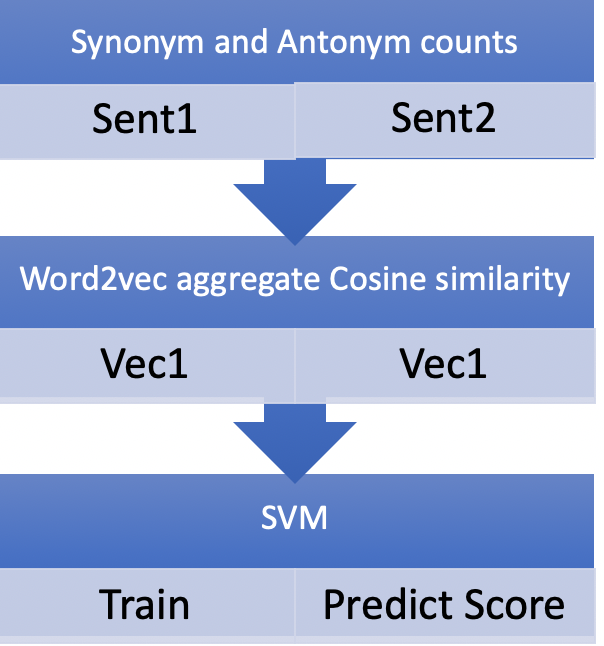
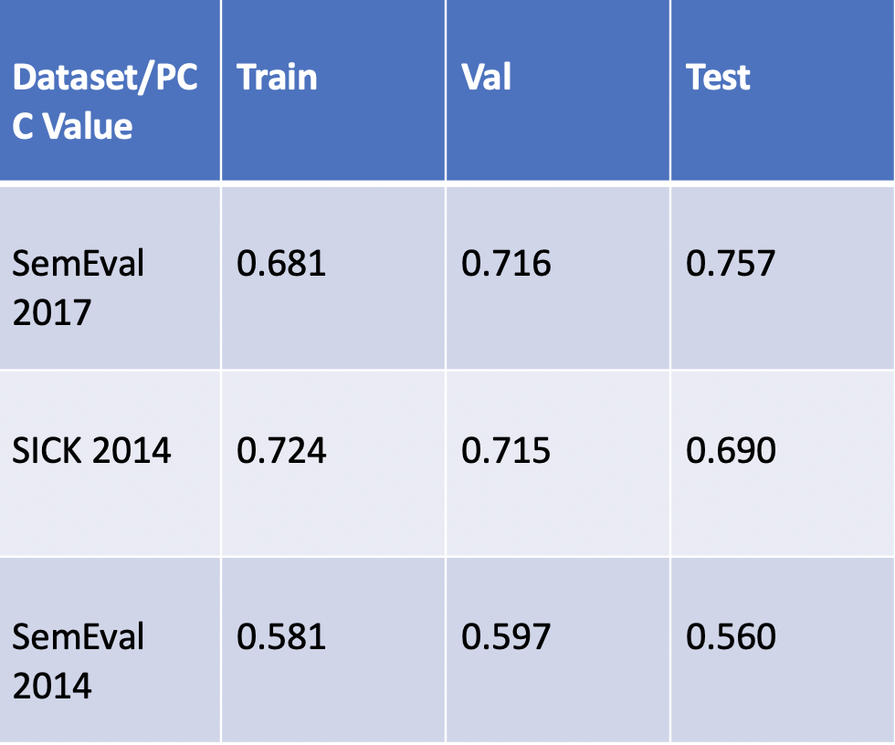

#  Semantic Textual Similarity using SVM's

- Title of the paper: DT Team at SemEval-2017 Task 1: Semantic Similarity Using Alignments, Sentence-Level Embeddings and Gaussian Mixture Model Output 
- Full citation : Nabin Maharjan, Rajendra Banjade, Dipesh Gautam, Lasang J. Tamang and Vasile Rus , “DT Team at SemEval-2017 Task 1: Semantic Similarity Using Alignments, Sentence-Level Embeddings and Gaussian Mixture Model Output ,” Proceedings of the 11th International Workshop on Semantic Evaluation (SemEval 2017), Association for Computational Linguistics, Vancouver, Canada 
https://www.aclweb.org/anthology/S17-2014

## Original Code
https://github.com/shivasuri/semantic_textual_similarity

## Description
- Use a Support Vector Regression model with features being synonym and antonym
 counts across the two sentences, word2vec aggregate cosine similarity
-The model was trained with with features being synonym and antonym
 counts across the two sentences, word2vec aggregate cosine similarity

 

## Input and Output

### Input:
List of sentence pairs – .txt file or .csv file
Train - ( Sentence1, Sentence2, Similarity score)
Test – (Sentence1, Sentence2)
 
### Output:
Train - model
Test – Similarity scores (float between 0.0-1.0)

## Evalution

### Evaluation Datasets

#### SemEval 2017 –Task1
5215 Sentence pairs with similarity scores.
STS 2017 will assess the ability of systems to determine the degree of semantic similarity between monolingual and cross-lingual sentences in Arabic, English and Spanish.

#### ICK 2014
The SICK data set consists of about 10,000 English sentence pairs, generated starting from two existing sets: the 8K ImageFlickr data set and the SemEval 2012 STS MSR-Video Description data set. 

#### SemEval 2014 –Task 10
A combination of 1785 sentence pairs with similarity scores from various sources like headlines, tweets and deft news.

### Evaluation Metric

Pearson Correlation Co-efficient (0-1)

### Results

## Demo

- [Jupyter notebook](https://drive.google.com/file/d/1GjNHq6gacdm5NClbl2EFC5Ve_9HQt2yg/view?usp=sharing)
- [Demo video](https://www.youtube.com/watch?v=mWkb76sAt6c)

## Notes

Download google’s word embeddings (word2vec). Make sure the GoogleNews-vectors-negative300.bin file you have downloaded is in the same directory as the code (i.e. main.py and svm_semantic_similarity.py.
Make sure you have installed the nltk library and WordNet; I use WordNet to find synonyms and antonyms.
>> conda install nltk
>> nltk.download()

In the pop-up window, select to download the “all” library.

Please be sure to install all libraries included as imports in the top of main.py and svm_semantic_similarity.py

Side note: my main class file name in the jupter notebook is different because I changed it from the upper case name to the lower case name.

Unit test file also reuires path to downloaded vectors file